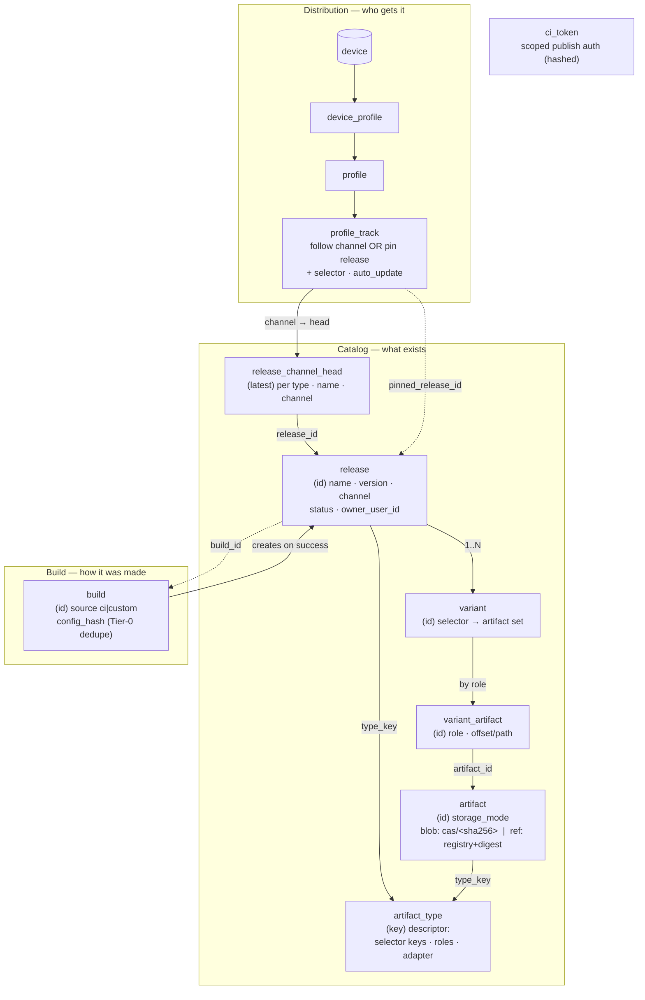
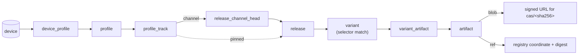

<!-- SPDX-License-Identifier: CC-BY-SA-4.0 -->

# Release / Upgrade Database Schema

The tables behind the release / OTA "upgrades" control plane
(`web/packages/core/helix-backend/src/db/release-schema.ts`). Three planes:
**Catalog** (what exists), **Build** (how it was made), **Distribution** (who gets it).

## Schema map

## Resolution flow (what a device's upgrade is)

## Notes

- **Solid edges** = hard FK (`variant→release`, `variant_artifact→variant`,
  `profile_track→profile` cascade). **Dotted edges** = logical reference by id
  (no DB FK): `variant_artifact.artifact_id`, `release.build_id`,
  `profile_track.pinned_release_id`, `*.type_key → artifact_type.key`.
- **`artifact` is one table, two modes:** `blob` (content-addressed bytes in
  object storage, unique on `sha256`) or `ref` (external registry coordinate +
  digest, unique on `registry+coordinate+digest`) — so firmware blobs and
  npm/OCI packages share the same shape.
- **CI vs custom** is just `release.owner_user_id` (null = CI/official, set = a
  user's build) and `build.source`.
- **"latest"** is the mutable `release_channel_head` pointer (free-string
  versions aren't orderable); publishing updates it.
- **Tier-0 dedupe** for custom builds keys on `build.config_hash`.
