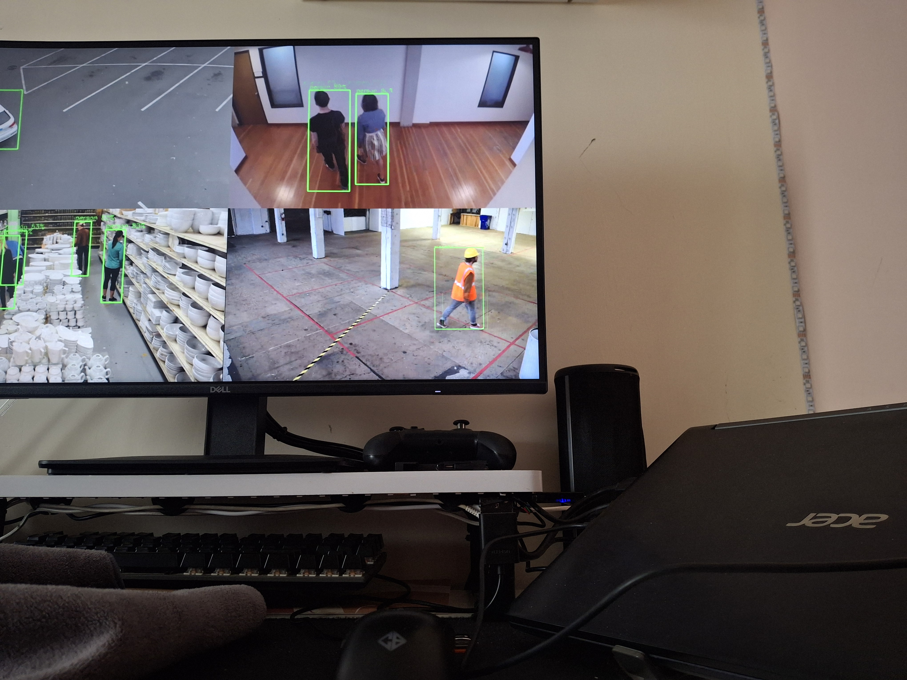
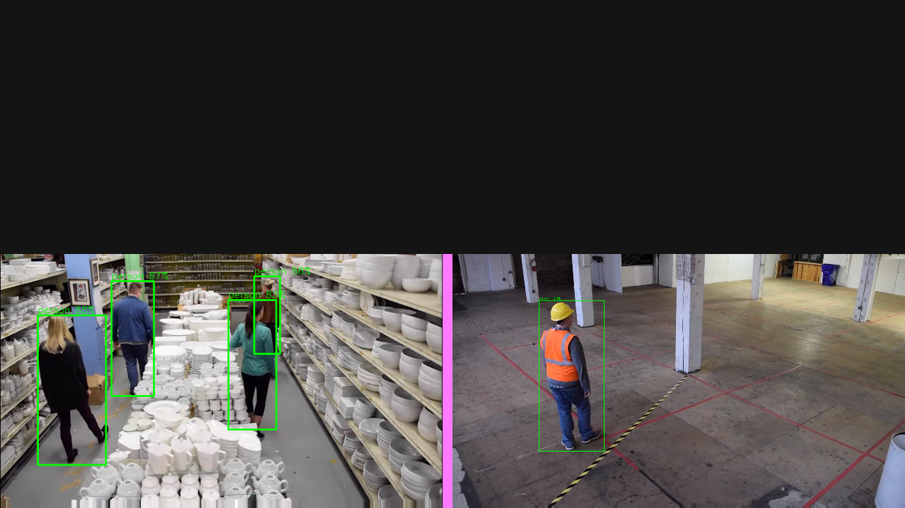
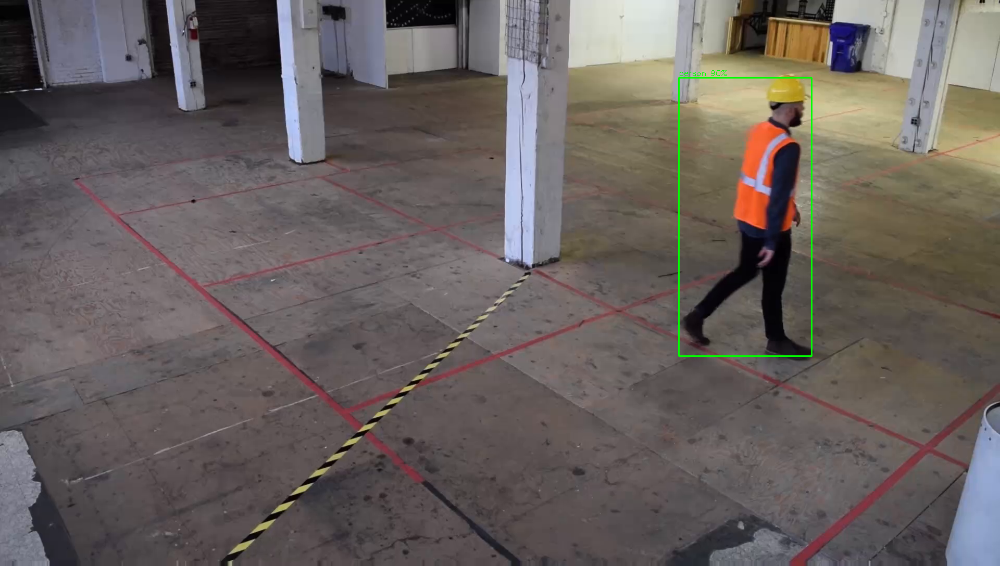

<!-- SPDX-License-Identifier: CC-BY-SA-4.0 -->

# 02 — Standalone on-device display (direct DRM) + the DisplayPort root cause

Date: 2026-07-25

**Goal:** the board drives the detection grid onto a physical monitor **by
itself** — no laptop, no WebRTC in the loop. This is a real product requirement
(an edge appliance shows its own output), not a debug convenience.

This was the hardest debugging of the session. The monitor was black for hours
across many attempts. The root cause turned out to be **link bandwidth on the
USB-C DisplayPort-alt-mode port plus a wrong hardcoded resolution** — nothing to
do with DRM, `kmssink`, or the pipeline.



*Live NPU detections scanned straight to the DisplayPort panel from the board.*

---

## 1. The symptom

Every attempt to show the grid on the monitor produced a **black screen with the
backlight off**. `modetest`/`kmssink`/direct-DRM all reported the modeset
*succeeding* (connector `connected`, `dpms On`, `SetCrtc` returns 0), yet no
signal reached the panel. The kernel log churned:

```
switcher 10.phy_switcher: … set mux state STATE_DP_D -> STATE_DP_D
```

An early note wrongly recorded the panel's native mode as **2560×1440**, so every
attempt hardcoded 1440p.

---

## 2. Root cause

Two things stacked:

1. **The monitor is driven over the USB-C DisplayPort-alt-mode port.** That port
   shares the connector's high-speed lanes with USB3, so it brings up only
   **2 DP lanes**, roughly *half* the link bandwidth of a full 4-lane DP/HDMI
   connector.

2. **2560×1440@60 needs a 248 MHz pixel clock** — too much for a 2-lane link, so
   **link training never completes → no signal → backlight off**. That is exactly
   the `STATE_DP_D -> STATE_DP_D` churn.

The panel's **EDID-preferred mode is actually `1920×1080@60` (148 MHz)** — which
*does* fit the 2-lane budget. The "native 1440p" note was simply wrong.

Enumerate the truth with:

```sh
modetest -M sunxi-drm -c      # connector 153 = DP-1; look for "type: preferred"
```

```
153  152  connected  DP-1  600x340  21  152
  #0 1920x1080 60.00 … type: preferred, driver     ← the real native mode
  #1 2560x1440 60.00 …           type: driver      ← too much for 2 lanes
```

### Proof

At **1920×1080** the link trains, the backlight comes on, and pixels appear —
confirmed two independent ways (both eyes-verified on the physical Dell):

- `modetest -M sunxi-drm -s 153@100:1920x1080` → sharp SMPTE bars.
- [`src/drmshow.c`](../src/drmshow.c) (dumb XRGB8888 FB + `drmModeSetCrtc` at the
  1080p modeline) → clean 4-quadrant RGB pattern.

> **Holding `modetest` open:** `modetest -s` calls `getchar()` and tears the mode
> down on EOF. Under `systemd-run` (no stdin) it exits instantly, so a snapshot
> catches nothing. Feed it a blocking fifo:
> `sh -c 'sleep 600 >/tmp/mf & exec modetest … </tmp/mf'`.

> An **HDMI cable** on the real HDMI-A-1 connector (147) would likely bring up
> 4 lanes and allow 1440p. Not available at the time; the DP-alt-mode fix is to
> use the 1080p preferred mode.

The 1080p modeline used everywhere:

```
clock 148500  hdisp 1920 hss 2008 hse 2052 htot 2200
              vdisp 1080 vss 1084 vse 1089 vtot 1125  flags NHSYNC|NVSYNC
```

---

## 3. The display path: direct-DRM RGB primary plane

`kmssink` was abandoned (it *appeared* broken only because of the link-down at
1440p, and separately the NV12 overlay plane had a green-lines quirk). The clean
path is **direct DRM scanout on the RGB primary plane**, integrated in-process in
[`src/npu_grid_display.cpp`](../src/npu_grid_display.cpp) (`drm_init` /
`drm_show`):

1. `open("/dev/dri/card0")`, `drmSetMaster`.
2. One **dumb XRGB8888** framebuffer at 1920×1080, `drmModeAddFB`, `mmap`.
3. Per display frame (throttled to ~7 fps): `cv::resize(grid 1280×720 → 1920×1080)`
   then `cv::cvtColor(BGR → BGRA)` **straight into the FB mmap** (respecting the
   DRM pitch — **XRGB8888 == OpenCV BGRA byte order**, so this is a direct write).
4. `drmModeSetCrtc` **once** on the first frame to latch the mode; afterwards the
   Display Engine keeps scanning the same buffer, so in-place writes just appear.
5. Teardown: `drmDropMaster` + `close`.

**Single buffer on purpose.** A first version alternated two FBs with `SetCrtc`
each frame and produced a **stable colored tear line** (a non-vsync buffer swap
splicing two different frames). One buffer + content-over-content updates removes
it; at 7 fps on CCTV the in-place write race is imperceptible.

Build additions: `-I/usr/include/libdrm` and `-ldrm`.

> **C++ gotcha:** g++ rejects a designated initializer for `drmModeModeInfo`'s
> `char name[]` field (*"C99 designator 'name' outside aggregate initializer"*).
> Fill the mode struct with plain assignments in `drm_init`, not
> `{.clock=…, .name=…}`.

**Cost:** with the display on, aggregate detection is **20.7 inf/s vs 21.4 off
(~3 %)**, NPU ~66 %. The in-process direct-DRM path does **not** starve inference.

> A rejected earlier approach — a *separate* process pulling `/detgrid` back over
> the network → decode → `kmssink` — **starved inference**: the extra ~1.5-core
> decode saturated the board, the detection `rtspsrc` inputs timed out on
> MediaMTX and never reconnected, and the NPU went to 0 %. Building the display
> **into** the detection process is what keeps it cheap.

---

## 4. The magenta-seam bug (macroblock padding)

Once the grid displayed, a bright-**magenta seam** appeared at the cell
boundaries — visible only on the monitor, never on WebRTC.



**Root cause: the decoder emits macroblock-padded frames.** A 1080p RTSP stream
decodes to **1920×1088** (1080 padded up to the next multiple of 16 → 8 garbage
rows; other streams pad the right edge):



Resizing the **full padded frame** into each 640×360 cell dragged that padding
strip into the cell edge, where it read as a ~2 px colored line at every cell
boundary.

Why it was invisible on the stream but crisp on the monitor: **NV12 4:2:0 chroma
subsampling + H.264 compression smear a 2 px colored line into near-nothing**,
while direct RGB scanout preserves it razor-sharp. That is why the WebRTC output
always looked clean while the panel had seams.

**Fix:** crop a small bottom/right margin off each decoded frame before compositing
(≥ the 15 px max MB padding), in `npu_grid_display.cpp`:

```cpp
cv::Rect roi(0, 0, frame.cols - (frame.cols > 16 ? 16 : 0),
                   frame.rows - (frame.rows > 16 ? 16 : 0));
cv::resize(frame(roi), latest[i], cv::Size(CW, CH));
```

16 px loss on an already-aligned stream is imperceptible in a 640-wide cell. Seam
gone.

---

## 5. Durable standalone boot

`npu-detgrid.service` runs it standalone on boot **and** publishes WebRTC
simultaneously:

- `ExecStart` ends with the `disp` arg (enables direct-DRM display).
- `Conflicts=sddm.service` + `After=sddm.service`, and **`sddm` is
  `disable --now`'d**, so the process can grab DRM master (bare-KMS).

The board now boots straight into the live detection display on the DP monitor.

---

## 6. Takeaways

- On a shared USB-C DP-alt-mode port, **assume 2 lanes** and read the EDID
  **preferred** mode (`modetest -c`) — do not assume the highest listed mode.
- **Backlight on vs off** is the fastest link-training signal: off = link never
  trained (drop the pixel clock), on-but-black = a plane/scanout problem.
- A lossy stream is a **poor oracle** for display correctness — chroma subsampling
  hides pixel-exact artifacts that a direct RGB panel exposes.
- Build the display **into** the compute process; a network round-trip for local
  display starves the accelerator.
