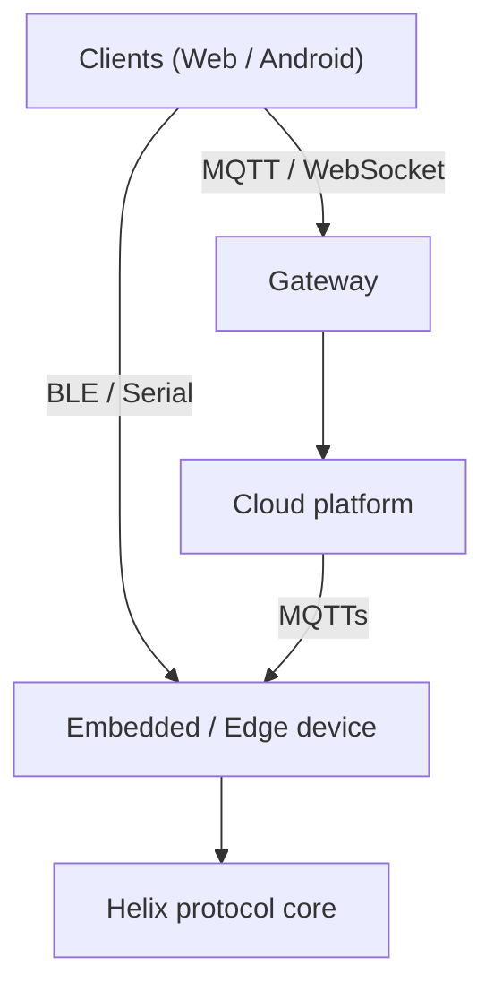

Helix spans the full stack, but every layer is an independently adoptable
library or SDK. You compose only the pieces you need, and they all speak one
transport-neutral protocol.

## The layers

### Embedded firmware

ESP32 (ESP-IDF) and Arduino/AVR (FreeRTOS) firmware are built on a shared,
transport-abstracting protocol core: packet, dispatch, endpoint, and transports.
Application services — OTA, secure MQTTs provisioning, file transfer, a durable
event queue, and an on-device store — layer cleanly on top.

### Edge Linux OS

A minimal, purpose-built Linux image for Jetson, Raspberry Pi, and x86. It ships
only what the workload needs and is fully manageable end-to-end over MQTTs.

### Cloud platform

All backend capability lives in one reusable package: the database, tRPC
routers, storage providers, PKI, the event queue, an MQTT bridge, and the
releases/OTA control plane. Apps are thin wiring over composable server roles
(gateway, ingest, writer).

### Clients

A React/Next.js web app and a BLE-first native Android (Compose) app, both built
on the same protocol/service/transport split. They talk to devices locally over
BLE/Serial or remotely over MQTT/WebSockets.

## The unifying seam

Every layer meets at the [Helix protocol](/docs/protocol): a typed
request/response and query/mutation surface that abstracts the transport. Add a
transport without touching services; register a service without touching
transports.
