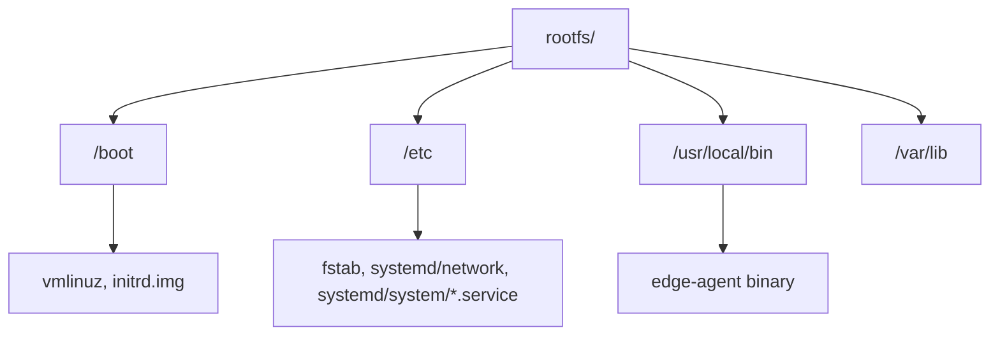

Most vendor SD-card images for single-board computers ship a full desktop-adjacent Linux distribution: a graphical stack you'll never use, a language runtime you don't need, a firewall daemon fighting your own iptables rules, and a few gigabytes of packages that exist purely so the image "just works" out of the box for the widest possible audience. If you're building a fleet of edge devices that run one job — read some sensors, hold an MQTT connection, serve a small API — that convenience is actually a tax you pay on every boot, every OTA update, and every security audit. This tutorial walks through building your own minimal root filesystem from scratch with `debootstrap`, configuring it in a chroot, packaging it into something you can boot, and smoke-testing it in QEMU before it ever touches real hardware.

## Why build a minimal image instead of shipping the vendor SD image

A stock Raspberry Pi OS or Ubuntu Server image typically unpacks to 2-4GB and boots several hundred running processes and services you didn't ask for. For an edge device that's a liability in four concrete ways:

- **Boot time.** Fewer units for systemd to sequence means the difference between a device that's reachable in 3 seconds after power-on and one that takes 25. On a device that gets power-cycled by a flaky relay in the field, that matters.
- **Attack surface.** Every installed daemon is something that can have a CVE. A minimal image with no display server, no print spooler, and no unused network services has a dramatically smaller set of things to patch and worry about.
- **Reproducibility.** A hand-built rootfs is a script, not a golden image someone downloaded once and forgot how to regenerate. You can diff two builds, pin package versions, and rebuild identically from a clean checkout.
- **RAM and storage.** On a device with 512MB-1GB of RAM, the difference between a 120MB rootfs and a 2GB one is the difference between headroom for your application and constant page-cache thrashing.

The tool for the first job — laying down a Debian (or Ubuntu) base system without installing a whole distribution's worth of extras — is `debootstrap`. It's the same tool Debian's own installer uses internally, so the result is a completely standard, unmodified Debian system; it's just missing everything you didn't ask for.

## Prerequisites

You'll need a Debian- or Ubuntu-based build host (a container or VM is fine) with root access, and a handful of packages. If your target board is a different CPU architecture than your build machine — the common case, building an arm64 image on an amd64 laptop — you also need userspace QEMU emulation wired into the kernel's binfmt_misc handler so the chroot can actually execute foreign-architecture binaries.

```bash
sudo apt-get update
sudo apt-get install -y debootstrap qemu-user-static binfmt-support \
  parted dosfstools e2fsprogs rsync systemd-container qemu-system-arm
```

| Tool | What it's for |
|---|---|
| `debootstrap` | Bootstraps a base Debian/Ubuntu rootfs from a package mirror |
| `qemu-user-static` | Static QEMU binaries registered with binfmt_misc so the host kernel can transparently run foreign-arch ELF binaries (needed to chroot into an arm64 rootfs from amd64) |
| `binfmt-support` | Registers the QEMU interpreters with the kernel so `chroot`/`exec` "just works" for the foreign arch |
| `parted`, `dosfstools`, `e2fsprogs` | Partition and format the disk image (GPT, FAT32 ESP, ext4 root) |
| `systemd-container` | Provides `systemd-nspawn`, a cleaner alternative to a manual bind-mount chroot |
| `qemu-system-arm`/`qemu-system-aarch64` | Full-system emulation to smoke-boot the finished image before flashing real hardware |

> This walkthrough targets arm64 (aarch64) as the device architecture, which is the common case for Raspberry Pi 3/4/5, Jetson-class boards, and most modern SBCs. Everything applies verbatim to armhf or amd64 targets — just change `--arch` and the QEMU binary.

## Step 1: debootstrap the root filesystem

Create a working directory and run debootstrap with `--variant=minbase`. The default "buildd" and full variants pull in things like man pages, a full documentation set, and a larger base package set; `minbase` gives you the smallest set of packages that still forms a working, apt-manageable system — you add back exactly what you need with `--include`.

```bash
mkdir -p ~/edge-build/rootfs
cd ~/edge-build

sudo debootstrap --arch=arm64 --variant=minbase --foreign \
  --include=systemd-sysv,udev,systemd-network,systemd-resolved,\
ifupdown,iproute2,openssh-server,ca-certificates,sudo,locales \
  trixie ./rootfs http://deb.debian.org/debian
```

Because the target architecture (arm64) differs from the build host (amd64), this only does the "first stage": it downloads and unpacks the .deb files but can't run any of their post-install scripts, since those scripts are arm64 ELF binaries the host CPU can't execute directly. That's what `--foreign` signals. To finish the job, copy the static QEMU interpreter into the new rootfs and run the second stage inside a chroot — the kernel's binfmt_misc registration transparently routes execution of the arm64 binaries through QEMU:

```bash
sudo cp /usr/bin/qemu-aarch64-static ./rootfs/usr/bin/

sudo chroot ./rootfs /debootstrap/debootstrap --second-stage
```

If that command fails with "exec format error" before it even starts, binfmt_misc isn't registered for aarch64 — see the Troubleshooting section below. Once the second stage completes you have a fully unpacked, apt-functional Debian base system sitting in `./rootfs`, roughly 250-350MB depending on the package list.

## Step 2: chroot in and configure the system

You have two ways to enter the environment: a manual chroot with the pseudo-filesystems bind-mounted in, or `systemd-nspawn`, which does all of that for you plus gives you a proper isolated container (its own PID namespace, no risk of a stray process from inside the chroot surviving after you exit). Prefer nspawn when it's available.

```bash
# Manual chroot
sudo mount --bind /dev  ./rootfs/dev
sudo mount --bind /proc ./rootfs/proc
sudo mount --bind /sys  ./rootfs/sys
sudo cp /etc/resolv.conf ./rootfs/etc/resolv.conf
sudo chroot ./rootfs /bin/bash

# Or, the cleaner option — one command, auto-cleanup on exit
sudo systemd-nspawn -D ./rootfs
```

Everything below runs *inside* that shell.

### Root password, hostname, fstab

```bash
passwd
echo edge01 > /etc/hostname
cat > /etc/hosts <<'EOF'
127.0.0.1   localhost
127.0.1.1   edge01
EOF

cat > /etc/fstab <<'EOF'
/dev/vda2  /       ext4  defaults,noatime  0  1
/dev/vda1  /boot   vfat  defaults          0  2
EOF
```

### Timezone and locale

```bash
ln -sf /usr/share/zoneinfo/UTC /etc/localtime
sed -i 's/^# en_US.UTF-8/en_US.UTF-8/' /etc/locale.gen
locale-gen
echo 'LANG=en_US.UTF-8' > /etc/locale.conf
```

### Networking with systemd-networkd

Skip `ifupdown`/`/etc/network/interfaces` entirely and let `systemd-networkd` own the interface — it's already in the package list from Step 1. Modern kernels assign "predictable" interface names like `enp0s3` or `eth0` depending on the bus; a glob match keeps this working regardless of what the target hardware calls its NIC.

```bash
mkdir -p /etc/systemd/network
cat > /etc/systemd/network/20-wired.network <<'EOF'
[Match]
Name=en* eth0

[Network]
DHCP=yes

[DHCP]
RouteMetric=10
EOF

systemctl enable systemd-networkd
systemctl enable systemd-resolved
ln -sf /run/systemd/resolve/stub-resolv.conf /etc/resolv.conf
```

### Installing a couple more packages

With networking sorted out for the target device (the resolv.conf you copied earlier is only for apt inside the build chroot), pull in the kernel and anything your workload needs:

```bash
apt-get update
apt-get install -y --no-install-recommends linux-image-arm64
```

### A custom systemd service

This is the actual payload of the device — whatever binary polls sensors, holds the uplink connection, or serves your API. Drop it into `/usr/local/bin` and wire up a unit for it. The important bits are `Restart=always` (systemd respawns it if it crashes or the process it's watching dies) and `WantedBy=multi-user.target` (so it comes up automatically on every boot without you calling `systemctl start` by hand).

```ini
[Unit]
Description=Edge device agent
After=network-online.target
Wants=network-online.target

[Service]
Type=simple
ExecStart=/usr/local/bin/edge-agent
Restart=always
RestartSec=2
User=edge
Group=edge
AmbientCapabilities=CAP_NET_BIND_SERVICE
NoNewPrivileges=true

[Install]
WantedBy=multi-user.target
```

```bash
useradd --system --create-home --shell /usr/sbin/nologin edge
cp /path/to/edge-agent /usr/local/bin/edge-agent
chmod +x /usr/local/bin/edge-agent

cat > /etc/systemd/system/edge-agent.service <<'EOF'
[Unit]
Description=Edge device agent
After=network-online.target
Wants=network-online.target

[Service]
Type=simple
ExecStart=/usr/local/bin/edge-agent
Restart=always
RestartSec=2
User=edge
Group=edge
AmbientCapabilities=CAP_NET_BIND_SERVICE
NoNewPrivileges=true

[Install]
WantedBy=multi-user.target
EOF

systemctl enable edge-agent.service
```

`systemctl enable` works fine inside a chroot/nspawn even though nothing is actually running — it just creates the symlink under `/etc/systemd/system/multi-user.target.wants/` that the real init will follow on first boot.

## Clean up before you package it

Still inside the chroot, drop the apt cache and any downloaded .deb archives — they're dead weight on a device that isn't going to `apt-get install` anything else, and they can easily be 30-50MB.

```bash
apt-get clean
rm -rf /var/lib/apt/lists/*
rm -f /usr/bin/qemu-aarch64-static
exit
```

Removing the static QEMU binary matters: it was only there so the build host could execute arm64 code during debootstrap's second stage. Leaving it in place is harmless on real hardware (it just never gets called) but there's no reason to ship it.

## Package it into a bootable image

For QEMU smoke-testing, the fastest path is to skip bootloaders entirely: format a raw ext4 image, rsync the rootfs into it, and hand the kernel + initrd you just installed straight to QEMU's `-kernel`/`-initrd` flags. QEMU's `virt` machine type loads them directly, the same way a real bootloader would hand off to the kernel, without you needing GRUB or U-Boot in the loop.

```bash
truncate -s 1200M rootfs.img
mkfs.ext4 -L rootfs rootfs.img

mkdir -p /tmp/mnt
sudo mount -o loop rootfs.img /tmp/mnt
sudo rsync -aHAX --exclude=/boot/vmlinuz* --exclude=/boot/initrd.img* \
  ./rootfs/ /tmp/mnt/
sudo umount /tmp/mnt
```

For real hardware you instead build a proper partitioned disk image with an EFI System Partition and a bootloader, so the board's firmware can find and load the kernel on its own without QEMU's help:

```bash
truncate -s 1200M disk.img
parted disk.img --script -- \
  mklabel gpt \
  mkpart ESP fat32 1MiB 257MiB \
  set 1 esp on \
  mkpart root ext4 257MiB 100%

sudo losetup --find --show -P disk.img   # e.g. /dev/loop0
sudo mkfs.vfat -F32 -n BOOT /dev/loop0p1
sudo mkfs.ext4 -L root /dev/loop0p2

sudo mount /dev/loop0p2 /tmp/mnt
sudo mkdir -p /tmp/mnt/boot/efi
sudo mount /dev/loop0p1 /tmp/mnt/boot/efi
sudo rsync -aHAX ./rootfs/ /tmp/mnt/
sudo umount /tmp/mnt/boot/efi /tmp/mnt
sudo losetup -d /dev/loop0
```

| Partition | Type | Typical size | Contents |
|---|---|---|---|
| 1 — ESP | FAT32, EFI System | 256MB | Bootloader (grub-efi-arm64 or U-Boot), kernel, initrd |
| 2 — root | ext4 | remaining space | The full rootfs from debootstrap |

Installing an actual bootloader into that ESP (running `grub-install` against the loop device from inside an nspawn shell, or copying a board-specific U-Boot binary to a fixed offset) is board-specific enough that it's outside the scope of this walkthrough — consult your SBC's boot documentation. The kernel-plus-QEMU path below doesn't need any of that.

## Boot it in QEMU

Point QEMU's ARM `virt` board at the kernel and initrd that `linux-image-arm64` installed into `rootfs/boot`, and at the ext4 image as a virtio block device. `console=ttyAMA0` tells the kernel to put its console on the virt board's PL011 UART, which QEMU's `-nographic` flag then multiplexes onto your terminal.

```bash
KERNEL=$(ls ./rootfs/boot/vmlinuz-* | sort -V | tail -1)
INITRD=$(ls ./rootfs/boot/initrd.img-* | sort -V | tail -1)

qemu-system-aarch64 \
  -M virt -cpu cortex-a53 -m 512 \
  -kernel "$KERNEL" \
  -initrd "$INITRD" \
  -append "root=/dev/vda rw console=ttyAMA0 rootfstype=ext4" \
  -drive file=rootfs.img,format=raw,if=none,id=hd0 \
  -device virtio-blk-device,drive=hd0 \
  -netdev user,id=net0 -device virtio-net-device,netdev=net0 \
  -nographic
```

You should see the kernel's boot log scroll by, followed by systemd bringing up units, and finally a login prompt. Log in as `root` with the password you set earlier and confirm the service came up on its own:

```bash
systemctl status edge-agent.service
systemctl status systemd-networkd
ip addr show
```

To exit QEMU cleanly, use `Ctrl-A X` in the terminal rather than closing the window — that sends QEMU its quit command instead of yanking power from the guest mid-write.


*The whole build is five deterministic, scriptable stages — none of them require a graphical installer or a pre-baked vendor image.*



*Layout of the finished rootfs — the same directory tree a full distribution would have, just without the packages you didn't ask for.*

## Troubleshooting

- **"Exec format error" running the second stage or anything inside the chroot.** The kernel doesn't know how to run arm64 binaries because binfmt_misc isn't registered for that architecture. Reinstall/re-register with `sudo apt-get install --reinstall qemu-user-static binfmt-support` and check `/proc/sys/fs/binfmt_misc/qemu-aarch64` exists and shows `enabled`. On some minimal build hosts (containers without `systemd` as PID 1) you may need to register it manually with `update-binfmts --enable qemu-aarch64`.
- **debootstrap second-stage fails partway through with package configuration errors.** Check `./rootfs/debootstrap/debootstrap.log` for the actual dpkg error — it's almost always either a missing `/proc` mount (bind-mount it before running `--second-stage` manually via chroot) or a stale/incomplete download from the first stage; rerunning `debootstrap` from scratch against a clean directory is usually faster than debugging a half-configured system.
- **No network once the guest boots.** Confirm `systemctl status systemd-networkd` is active and check `networkctl list` for the interface's actual name — a `.network` file whose `[Match]` section doesn't cover the real interface name (e.g. it's `enp0s1` but you only matched `eth0`) silently leaves the link unconfigured. The glob `en*` in the example above covers most predictable names; add the specific name you see in `ip link` if it still doesn't match.
- **Kernel panic: "VFS: Unable to mount root fs".** Almost always a mismatch between the `root=` kernel parameter and how QEMU actually exposes the disk. A `virtio-blk-device` shows up as `/dev/vda`; a `virtio-blk-pci` device can enumerate differently depending on other PCI devices present. Double-check the `-append` string matches the `-device` you actually passed, and that `rootfstype=ext4` is present if the kernel can't auto-detect the filesystem from the initrd's module set.
- **Rootfs mounts read-only and services fail to write logs or state.** Your `/etc/fstab` entry for `/` is missing `rw` or a prior unclean shutdown left an ext4 journal that needs replaying — boot with `fsck.mode=force` once, or mount and run `e2fsck -f rootfs.img` from the host (with the loop device, not while QEMU has it open).
- **apt-get fails inside the chroot with DNS resolution errors.** The chroot has no working `/etc/resolv.conf` of its own — copy the host's in before running any `apt-get` commands (`sudo cp /etc/resolv.conf ./rootfs/etc/resolv.conf`), and remember to remove or replace it with the networkd-managed symlink before you package the image, or the device will boot with your build host's DNS servers hardcoded in.

## Wrap-up

Everything above is a handful of shell commands and two configuration files — no vendor image, no GUI installer, no mystery packages you'll spend a security review explaining away later. The pipeline is also fully scriptable end to end: wrap the debootstrap invocation, the chroot configuration block, and the image-packaging step in a single build script, and you have a rootfs you can regenerate identically every time a base package gets a CVE fix, rather than one you downloaded once and now have to patch by hand. From here, the natural next steps are pinning the Debian snapshot mirror so builds are byte-for-byte reproducible, scripting the QEMU boot as an automated smoke test that checks your service actually reaches "active" before you flash real hardware, and building out a proper A/B partition scheme so a bad OTA update never bricks a device in the field.
