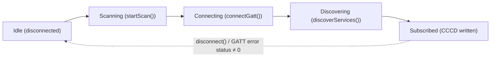
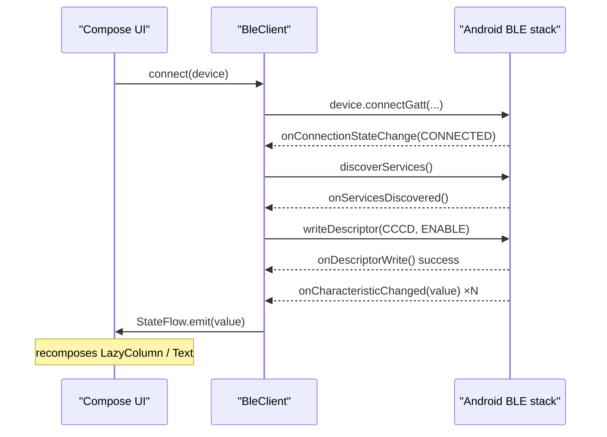

Bluetooth Low Energy is still the most common way an Android app talks to a small embedded device — a heart-rate strap, an environmental sensor, a hobbyist board running a GATT server. The API surface for it hasn't changed its shape much since Android 5.0, but the permission model around it has been rewritten twice, and the callback-heavy design doesn't map cleanly onto Compose and coroutines without some plumbing. This tutorial builds a small but complete BLE client from scratch: runtime permissions for both old and new Android versions, scanning with a service-UUID filter, connecting over GATT, discovering services, subscribing to notifications by hand-writing the client characteristic configuration descriptor, and wrapping all of it in a class that exposes `StateFlow` so a Jetpack Compose screen can just collect and render.

Everything here uses the stock Android BLE APIs (`android.bluetooth.le`) — no vendor SDK, no third-party BLE library. By the end you'll have a scan button, a live list of discovered devices, a connect action, and a screen that shows values streaming in from a notified characteristic.

## Prerequisites

- Android Studio Ladybug or newer, with an SDK setup that includes API 34 and API 35.
- A project targeting `compileSdk = 35`, `minSdk = 26`, using Kotlin 2.0+ and the Jetpack Compose compiler plugin.
- A physical Android device (API 31+ ideally, to exercise the current permission model) — the emulator does not support real BLE radios.
- Some BLE peripheral to test against. Any GATT server with a notifiable characteristic works: a fitness tracker, a nRF52 dev board running a demo firmware, or a phone-as-peripheral test app. The examples below use the standard Bluetooth SIG Heart Rate Service (`0000180d-...`) and its Heart Rate Measurement characteristic (`00002a37-...`) purely as a stand-in — swap in your own service and characteristic UUIDs.

> **Note:** BLE operations only work on a real device. If `BluetoothAdapter.getDefaultAdapter()` returns `null` or `bluetoothLeScanner` is `null`, you're most likely on an emulator or a device with Bluetooth disabled.

## 1. Gradle setup

The BLE APIs themselves ship in the platform SDK, so there's no BLE-specific artifact to add. You do need Compose, the ViewModel-Compose integration, and the lifecycle-aware `collectAsStateWithLifecycle` extension:

```kotlin
// app/build.gradle.kts
android {
    compileSdk = 35
    defaultConfig {
        applicationId = "com.example.bleclient"
        minSdk = 26
        targetSdk = 35
    }
    buildFeatures {
        compose = true
    }
}

dependencies {
    implementation(platform("androidx.compose:compose-bom:2024.09.00"))
    implementation("androidx.compose.material3:material3")
    implementation("androidx.compose.ui:ui-tooling-preview")
    implementation("androidx.activity:activity-compose:1.9.2")
    implementation("androidx.lifecycle:lifecycle-viewmodel-compose:2.8.6")
    implementation("androidx.lifecycle:lifecycle-runtime-compose:2.8.6")
    implementation("org.jetbrains.kotlinx:kotlinx-coroutines-android:1.8.1")
}
```

## 2. Declare permissions

Android 12 (API 31) split the old blanket `BLUETOOTH`/`BLUETOOTH_ADMIN` pair into `BLUETOOTH_SCAN` and `BLUETOOTH_CONNECT`, and made them independent of location permission — provided you declare that you aren't using scan results to derive physical location. Because you still support API 26+, the manifest needs both the modern and legacy permission blocks, scoped by `maxSdkVersion` / target API so the manifest merger and the Play Store permission declaration stay correct on every OS version.

```xml
<manifest xmlns:android="http://schemas.android.com/apk/res/android"
    xmlns:tools="http://schemas.android.com/tools">

    <!-- API 30 and below -->
    <uses-permission android:name="android.permission.BLUETOOTH"
        android:maxSdkVersion="30" />
    <uses-permission android:name="android.permission.BLUETOOTH_ADMIN"
        android:maxSdkVersion="30" />
    <uses-permission android:name="android.permission.ACCESS_FINE_LOCATION"
        android:maxSdkVersion="30" />

    <!-- API 31+ -->
    <uses-permission android:name="android.permission.BLUETOOTH_SCAN"
        android:usesPermissionFlags="neverForLocation"
        tools:targetApi="s" />
    <uses-permission android:name="android.permission.BLUETOOTH_CONNECT" />

    <uses-feature android:name="android.hardware.bluetooth_le" android:required="true" />

    <application ... >
        ...
    </application>
</manifest>
```

`usesPermissionFlags="neverForLocation"` is the important bit: it tells the system your app promises not to use BLE scan results to physically locate the user, which means you do *not* need `ACCESS_FINE_LOCATION` on API 31+. If your app genuinely does derive location from scan results, drop that flag and request `ACCESS_FINE_LOCATION` at runtime as well.

| API level | Permissions required | Granted how |
|---|---|---|
| ≤ 28 (Android 9 and below) | `BLUETOOTH`, `BLUETOOTH_ADMIN` | Install-time (normal) |
| 29–30 (Android 10–11) | `BLUETOOTH`, `BLUETOOTH_ADMIN`, `ACCESS_FINE_LOCATION` | Location is runtime/dangerous; also requires Location Services toggled on |
| 31–32 (Android 12–12L) | `BLUETOOTH_SCAN`, `BLUETOOTH_CONNECT` | Both runtime/dangerous; no location permission needed with `neverForLocation` |
| 33+ (Android 13+) | `BLUETOOTH_SCAN`, `BLUETOOTH_CONNECT` | Same as above; reading `device.name` also requires `BLUETOOTH_CONNECT` |

## 3. Request permissions at runtime

Use `rememberLauncherForActivityResult` with `ActivityResultContracts.RequestMultiplePermissions` to request the right set for the running OS version, and check first so you don't re-prompt a user who already granted them:

```kotlin
@Composable
fun rememberBlePermissionLauncher(onGranted: () -> Unit): () -> Unit {
    val context = LocalContext.current
    val permissions = remember {
        if (Build.VERSION.SDK_INT >= Build.VERSION_CODES.S) {
            arrayOf(Manifest.permission.BLUETOOTH_SCAN, Manifest.permission.BLUETOOTH_CONNECT)
        } else {
            arrayOf(Manifest.permission.ACCESS_FINE_LOCATION)
        }
    }

    val launcher = rememberLauncherForActivityResult(
        ActivityResultContracts.RequestMultiplePermissions(),
    ) { results -> if (results.values.all { it }) onGranted() }

    return remember(permissions) {
        {
            val allGranted = permissions.all {
                ContextCompat.checkSelfPermission(context, it) == PackageManager.PERMISSION_GRANTED
            }
            if (allGranted) onGranted() else launcher.launch(permissions)
        }
    }
}
```

Wire this to the scan button in the Compose screen later — tapping "Scan" calls the returned lambda, which either starts scanning immediately or shows the system permission dialog first.

## 4. Scan for devices

Get a `BluetoothLeScanner` off the adapter, build a `ScanFilter` for the service UUID you care about (scanning without a filter on a busy floor returns everything nearby and drains the battery), and collect results through a `ScanCallback`. Wrap it in a small class that exposes a `StateFlow<List<BluetoothDevice>>` so Compose can render it directly.

```kotlin
@SuppressLint("MissingPermission")
class BleScanner(context: Context, private val serviceUuid: UUID) {

    private val adapter = (context.getSystemService(Context.BLUETOOTH_SERVICE)
        as BluetoothManager).adapter
    private val scanner get() = adapter?.bluetoothLeScanner

    private val _devices = MutableStateFlow<List<BluetoothDevice>>(emptyList())
    val devices: StateFlow<List<BluetoothDevice>> = _devices.asStateFlow()

    private val _isScanning = MutableStateFlow(false)
    val isScanning: StateFlow<Boolean> = _isScanning.asStateFlow()

    private val callback = object : ScanCallback() {
        override fun onScanResult(callbackType: Int, result: ScanResult) {
            val device = result.device
            if (_devices.value.none { it.address == device.address }) {
                _devices.value = _devices.value + device
            }
        }

        override fun onScanFailed(errorCode: Int) {
            Log.w(TAG, "BLE scan failed: $errorCode")
            _isScanning.value = false
        }
    }

    fun start() {
        val filters = listOf(ScanFilter.Builder().setServiceUuid(ParcelUuid(serviceUuid)).build())
        val settings = ScanSettings.Builder()
            .setScanMode(ScanSettings.SCAN_MODE_LOW_LATENCY)
            .build()
        _devices.value = emptyList()
        _isScanning.value = true
        scanner?.startScan(filters, settings, callback)
    }

    fun stop() {
        scanner?.stopScan(callback)
        _isScanning.value = false
    }

    companion object { private const val TAG = "BleScanner" }
}
```

The `@SuppressLint("MissingPermission")` annotation is standard practice here: the BLE APIs are annotated with `@RequiresPermission`, and the lint checker cannot see that permissions were already verified one layer up in the Compose screen. It does not disable the runtime enforcement — an actual missing grant still throws a `SecurityException` at the OS level.

## 5. Connect over GATT

Call `connectGatt` on the chosen `BluetoothDevice`, explicitly passing `TRANSPORT_LE` (on dual-mode devices, omitting it can make the stack guess the wrong transport and silently fail to connect) and `autoConnect = false` for a direct, immediate connection attempt:

```kotlin
gatt = device.connectGatt(context, /* autoConnect = */ false, callback, BluetoothDevice.TRANSPORT_LE)
```

`autoConnect = true` queues the connection and waits for the device to come into range, which is useful for background reconnection but adds latency and is a common source of the infamous status 133 error on first connect — leave it `false` for an interactive "tap to connect" flow.

## 6. Discover services and subscribe to notifications

The full connect → discover → subscribe sequence happens inside one `BluetoothGattCallback`. Three things matter here: discovering services only after the connection state callback reports `STATE_CONNECTED`; enabling notifications with *both* `setCharacteristicNotification` (a local flag inside the Android BLE stack) *and* writing the Client Characteristic Configuration Descriptor, UUID `00002902-...`, with `ENABLE_NOTIFICATION_VALUE` (this is the byte pair the remote GATT server actually checks before it starts sending notifications — skipping it is the single most common reason "notifications" stay silent); and handling the Android 13 signature change for `onCharacteristicChanged`, which now hands you the value directly instead of requiring a separate `characteristic.value` read.

```kotlin
private val CCCD_UUID: UUID = UUID.fromString("00002902-0000-1000-8000-00805f9b34fb")

enum class BleConnectionState { DISCONNECTED, CONNECTING, DISCOVERING, SUBSCRIBED }

@SuppressLint("MissingPermission")
class BleClient(
    private val context: Context,
    private val serviceUuid: UUID,
    private val characteristicUuid: UUID,
) {
    private var gatt: BluetoothGatt? = null

    private val _connectionState = MutableStateFlow(BleConnectionState.DISCONNECTED)
    val connectionState: StateFlow<BleConnectionState> = _connectionState.asStateFlow()

    private val _lastValue = MutableStateFlow<ByteArray?>(null)
    val lastValue: StateFlow<ByteArray?> = _lastValue.asStateFlow()

    private val callback = object : BluetoothGattCallback() {

        override fun onConnectionStateChange(g: BluetoothGatt, status: Int, newState: Int) {
            if (status != BluetoothGatt.GATT_SUCCESS) {
                Log.w(TAG, "GATT error $status, closing")
                g.close()
                gatt = null
                _connectionState.value = BleConnectionState.DISCONNECTED
                return
            }
            when (newState) {
                BluetoothProfile.STATE_CONNECTED -> {
                    _connectionState.value = BleConnectionState.DISCOVERING
                    g.discoverServices()
                }
                BluetoothProfile.STATE_DISCONNECTED -> {
                    g.close()
                    gatt = null
                    _connectionState.value = BleConnectionState.DISCONNECTED
                }
            }
        }

        override fun onServicesDiscovered(g: BluetoothGatt, status: Int) {
            if (status != BluetoothGatt.GATT_SUCCESS) return
            val characteristic = g.getService(serviceUuid)?.getCharacteristic(characteristicUuid)
            if (characteristic == null) {
                Log.w(TAG, "target characteristic not found on device")
                return
            }
            g.setCharacteristicNotification(characteristic, true)
            val descriptor = characteristic.getDescriptor(CCCD_UUID) ?: return
            if (Build.VERSION.SDK_INT >= Build.VERSION_CODES.TIRAMISU) {
                g.writeDescriptor(descriptor, BluetoothGattDescriptor.ENABLE_NOTIFICATION_VALUE)
            } else {
                @Suppress("DEPRECATION")
                descriptor.value = BluetoothGattDescriptor.ENABLE_NOTIFICATION_VALUE
                @Suppress("DEPRECATION")
                g.writeDescriptor(descriptor)
            }
        }

        override fun onDescriptorWrite(g: BluetoothGatt, descriptor: BluetoothGattDescriptor, status: Int) {
            if (descriptor.uuid == CCCD_UUID && status == BluetoothGatt.GATT_SUCCESS) {
                _connectionState.value = BleConnectionState.SUBSCRIBED
            }
        }

        // API 33+
        override fun onCharacteristicChanged(
            g: BluetoothGatt,
            characteristic: BluetoothGattCharacteristic,
            value: ByteArray,
        ) {
            _lastValue.value = value
        }

        // API < 33
        @Deprecated("Superseded by the 3-arg overload on API 33")
        override fun onCharacteristicChanged(
            g: BluetoothGatt,
            characteristic: BluetoothGattCharacteristic,
        ) {
            if (Build.VERSION.SDK_INT < Build.VERSION_CODES.TIRAMISU) {
                @Suppress("DEPRECATION")
                _lastValue.value = characteristic.value
            }
        }
    }

    fun connect(device: BluetoothDevice) {
        _connectionState.value = BleConnectionState.CONNECTING
        gatt = device.connectGatt(context, false, callback, BluetoothDevice.TRANSPORT_LE)
    }

    fun disconnect() {
        gatt?.disconnect()
    }

    companion object { private const val TAG = "BleClient" }
}
```

Overriding both versions of `onCharacteristicChanged` and gating each with an SDK check is the cleanest way to support the whole API 26–35 range from one class without a runtime crash — the platform calls whichever overload matches its own API level, and the deprecated one is simply never invoked on API 33+.



*Connection states of the BLE client, from an idle adapter through to a subscribed characteristic, with any GATT error or explicit disconnect returning to idle.*

## 7. Wire it into a ViewModel

The `ViewModel` owns one `BleScanner` for the lifetime of the screen and creates a fresh `BleClient` per connection attempt, re-collecting its flows into the ViewModel's own state so the UI only ever depends on the ViewModel, not the BLE classes directly.

```kotlin
class BleViewModel(app: Application) : AndroidViewModel(app) {

    private val serviceUuid = UUID.fromString("0000180d-0000-1000-8000-00805f9b34fb")
    private val characteristicUuid = UUID.fromString("00002a37-0000-1000-8000-00805f9b34fb")

    private val scanner = BleScanner(app, serviceUuid)
    private var client: BleClient? = null

    val devices: StateFlow<List<BluetoothDevice>> = scanner.devices
    val isScanning: StateFlow<Boolean> = scanner.isScanning

    private val _connectionState = MutableStateFlow(BleConnectionState.DISCONNECTED)
    val connectionState: StateFlow<BleConnectionState> = _connectionState.asStateFlow()

    private val _lastValue = MutableStateFlow<ByteArray?>(null)
    val lastValue: StateFlow<ByteArray?> = _lastValue.asStateFlow()

    fun startScan() = scanner.start()
    fun stopScan() = scanner.stop()

    fun connect(device: BluetoothDevice) {
        scanner.stop()
        val newClient = BleClient(getApplication(), serviceUuid, characteristicUuid)
        client = newClient
        viewModelScope.launch { newClient.connectionState.collect { _connectionState.value = it } }
        viewModelScope.launch { newClient.lastValue.collect { _lastValue.value = it } }
        newClient.connect(device)
    }

    override fun onCleared() {
        client?.disconnect()
    }
}
```

## 8. Build the Compose screen

Collect every flow with `collectAsStateWithLifecycle` so collection automatically pauses when the screen isn't visible, drive the scan button through the permission launcher from step 3, and render discovered devices in a `LazyColumn`:

```kotlin
@Composable
fun BleScreen(viewModel: BleViewModel = viewModel()) {
    val devices by viewModel.devices.collectAsStateWithLifecycle()
    val isScanning by viewModel.isScanning.collectAsStateWithLifecycle()
    val connectionState by viewModel.connectionState.collectAsStateWithLifecycle()
    val lastValue by viewModel.lastValue.collectAsStateWithLifecycle()

    val requestScan = rememberBlePermissionLauncher(onGranted = { viewModel.startScan() })

    Column(modifier = Modifier.fillMaxSize().padding(16.dp)) {
        Button(onClick = requestScan, enabled = !isScanning) {
            Text(if (isScanning) "Scanning…" else "Scan for devices")
        }

        Spacer(modifier = Modifier.height(12.dp))
        Text("Connection: ${connectionState.name}")
        lastValue?.let { bytes ->
            Text("Last value: " + bytes.joinToString(" ") { "%02x".format(it) })
        }

        Spacer(modifier = Modifier.height(12.dp))
        LazyColumn {
            items(devices, key = { it.address }) { device ->
                ListItem(
                    headlineContent = { Text(deviceLabel(device)) },
                    supportingContent = { Text(device.address) },
                    modifier = Modifier.clickable { viewModel.connect(device) },
                )
            }
        }
    }
}

@SuppressLint("MissingPermission")
private fun deviceLabel(device: BluetoothDevice): String = device.name ?: "Unknown device"
```

That's a complete loop: tap scan, grant permissions if needed, see filtered devices stream into the list, tap one to connect, watch `connectionState` move through `CONNECTING → DISCOVERING → SUBSCRIBED`, and see `lastValue` update every time the peripheral sends a notification.



*Callback sequence from tapping connect through to a subscribed characteristic streaming values back into the Compose UI via StateFlow. Dashed arrows are asynchronous callbacks from the BLE stack.*

## Troubleshooting

| Symptom | Likely cause | Fix |
|---|---|---|
| Connection fails with status `133` (`GATT_ERROR`) | Stale internal GATT client, connecting with `autoConnect = true`, or hammering `connectGatt` too soon after a previous attempt | Always call `gatt.close()` on any terminal state, connect with `autoConnect = false` for interactive flows, and add a short backoff (a few hundred ms) before retrying a failed connect on the same device |
| Crash: `SecurityException: Need BLUETOOTH_SCAN permission` | Called `startScan` or `connectGatt` before the runtime permission was actually granted | Gate every BLE call behind the permission check from step 3; do not rely on the manifest declaration alone on API 23+ |
| Scan returns nothing on a device running Android 11 or older | System-wide Location Services toggle is off — pre-Android 12, BLE scanning is treated as a location API regardless of app permissions | Check `LocationManager.isLocationEnabled()` and prompt the user to enable Location Services, in addition to granting `ACCESS_FINE_LOCATION` |
| Scan returns nothing at all, ever | `ScanFilter` service UUID doesn't match what the peripheral actually advertises (16-bit vs 128-bit UUID, wrong endianness, or the UUID simply isn't in the advertisement packet) | Temporarily scan with an empty filter list and log every `ScanResult.scanRecord` to confirm the advertised UUIDs before filtering |
| Connects fine, but notifications never arrive | Called `setCharacteristicNotification(char, true)` but never wrote the CCCD (`0x2902`) descriptor — that local flag alone does not tell the remote GATT server to start sending | Always follow with a `writeDescriptor` call using `ENABLE_NOTIFICATION_VALUE`, as shown in `onServicesDiscovered` above, and wait for `onDescriptorWrite` success before assuming you're subscribed |
| Random silent failures, dropped writes, or a second `writeDescriptor`/`readCharacteristic` call doing nothing | Issuing GATT operations off the callback's thread, or issuing a second operation before the first one's callback fired — the Android BLE stack only allows one outstanding GATT operation at a time | Perform all GATT calls from the same thread the callbacks arrive on (the main thread by default), and serialize operations — queue the next write/read until the previous operation's callback has actually returned |

## Wrap-up

The pattern here generalizes past the exact permission/scan/connect/subscribe steps above: wrap Android's inherently callback-and-thread-sensitive BLE API in a plain class that owns exactly one connection's worth of state, republish that state as `StateFlow`, and let a `ViewModel` and Compose screen consume it the same way they'd consume any other flow-based data source. From here, the natural next steps are writing to characteristics (mirror `writeDescriptor` with `gatt.writeCharacteristic` and its own success callback), handling multiple simultaneous connections with a map of `BleClient` instances keyed by device address, and adding a small operation queue in front of the GATT calls so reads, writes, and descriptor writes issued back-to-back never race each other on the same connection.
