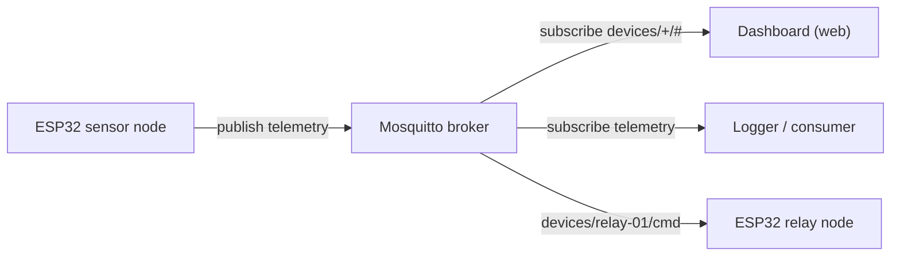

MQTT is the protocol most small embedded devices reach for the moment they need to talk to the outside world: it is lightweight, works over a single long-lived TCP connection, and gives you a publish/subscribe model instead of the request/response dance of HTTP. This tutorial walks through the whole path end to end — standing up a Mosquitto broker on Linux, securing it properly, and writing ESP32 firmware in the Arduino framework that publishes sensor telemetry and listens for remote commands. By the end you will have a broker you control, a topic layout that scales past one device, and firmware that survives Wi-Fi drops without falling over.

## MQTT basics in five minutes

MQTT (Message Queuing Telemetry Transport) is built around three roles. A **broker** is the server that every client connects to; it never initiates a connection itself. **Publishers** send messages to a named **topic**, a slash-delimited string like `devices/esp32-01/telemetry`. **Subscribers** tell the broker which topics (or topic patterns) they care about, and the broker forwards every matching message to them. A single client can be a publisher and a subscriber at the same time, and most embedded devices are exactly that.

A few concepts you will use constantly:

- **Wildcards.** `+` matches exactly one topic level, `#` matches everything below a point. Subscribing to `devices/+/telemetry` catches telemetry from every device; `devices/#` catches everything under `devices`, including commands and status.
- **QoS (Quality of Service).** Every publish and subscribe carries a QoS level of 0, 1, or 2 that controls delivery guarantees. Covered in detail below.
- **Retained messages.** A publish flagged `retain=true` is stored by the broker and immediately replayed to any new subscriber on that topic. This is how a dashboard that connects after a device has already reported its state can still learn the last known value.
- **Last Will and Testament (LWT).** When a client connects, it can register a message the broker should publish on its behalf if the connection drops uncleanly (no clean disconnect, TCP reset, keepalive timeout). This is the standard way to detect a device going offline.
- **Keepalive.** The client tells the broker an interval (in seconds); if the broker hears nothing — not even a PINGREQ — for 1.5x that interval, it treats the connection as dead and fires the LWT.

> MQTT has no built-in request/response, no schema, and no discovery mechanism. Topic naming and payload format are entirely up to you — get the topic hierarchy right early, because renaming topics later means touching every client.

## Prerequisites

- A Linux machine (or VM/container) to run the broker — any recent Debian/Ubuntu works for the apt instructions below.
- An ESP32 dev board, USB cable, and the Arduino IDE (or `arduino-cli`) with the `esp32` board package installed.
- The `PubSubClient` library by Nick O'Leary, installed via Library Manager or `arduino-cli lib install PubSubClient`.
- A Wi-Fi network the broker machine and the ESP32 can both reach.

## Standing up the broker

### Option A: apt install

On Debian/Ubuntu, Mosquitto and its command-line client tools are packaged directly:

```bash
sudo apt update
sudo apt install -y mosquitto mosquitto-clients

# stop the default service while we hand-write a config
sudo systemctl stop mosquitto
sudo systemctl disable mosquitto
```

### Option B: Docker

If you would rather not install anything system-wide, the official image only needs a config file and a couple of mounted volumes:

```bash
mkdir -p ~/mosquitto/{config,data,log}
# put mosquitto.conf (below) into ~/mosquitto/config/mosquitto.conf

docker run -d --name mosquitto \
  -p 1883:1883 \
  -v ~/mosquitto/config:/mosquitto/config \
  -v ~/mosquitto/data:/mosquitto/data \
  -v ~/mosquitto/log:/mosquitto/log \
  eclipse-mosquitto:2
```

### Writing mosquitto.conf

Start with the quickest possible setup to prove connectivity — anonymous access on the standard port. This is fine on an isolated lab network, never on anything reachable from the internet:

```ini
# mosquitto.conf -- anonymous, local testing only
listener 1883 0.0.0.0
allow_anonymous true

persistence true
persistence_location /var/lib/mosquitto/
log_dest file /var/log/mosquitto/mosquitto.log
```

Once that works, switch to authenticated access. Generate a password file with `mosquitto_passwd` (it hashes and salts the password, it does not store it in plaintext):

```bash
sudo mosquitto_passwd -c /etc/mosquitto/passwd esp32-01
# prompts for a password; drop -c when adding subsequent users
sudo mosquitto_passwd /etc/mosquitto/passwd dashboard
```

```ini
# mosquitto.conf -- authenticated
listener 1883 0.0.0.0
allow_anonymous false
password_file /etc/mosquitto/passwd

persistence true
persistence_location /var/lib/mosquitto/
log_dest file /var/log/mosquitto/mosquitto.log
```

Run it in the foreground first so you can see connection logs while you debug, then move it to a service once it behaves:

```bash
sudo mosquitto -c /etc/mosquitto/mosquitto.conf -v
```

Verify from another terminal with the CLI tools that shipped with `mosquitto-clients`. Subscribe wide, then publish into it:

```bash
mosquitto_sub -h localhost -t 'devices/#' -v -u dashboard -P <password>

# in a second terminal
mosquitto_pub -h localhost -t 'devices/esp32-01/telemetry' \
  -m '{"temp_c":21.4}' -u esp32-01 -P <password>
```

If the subscriber prints `devices/esp32-01/telemetry {"temp_c":21.4}`, the broker is working and you are ready to point real firmware at it.

## Designing a topic hierarchy

A topic scheme that scales past a single device puts the device identifier as a fixed segment and groups by purpose underneath it. A layout that works well for sensor/actuator devices:

| Topic | Direction | Purpose |
|---|---|---|
| `devices/<id>/telemetry` | device → broker | Periodic sensor readings, JSON payload |
| `devices/<id>/status` | device → broker | Retained online/offline state, also the LWT target |
| `devices/<id>/cmd` | broker → device | Commands sent to the device (relay on/off, config changes) |
| `devices/<id>/cmd/ack` | device → broker | Acknowledgement that a command was applied |

With this scheme a dashboard subscribes once to `devices/+/telemetry` and `devices/+/status` to see every device, while a single device only ever subscribes to its own `devices/<id>/cmd`. Keep identifiers stable (MAC-derived or a provisioned serial) rather than reusing something like a Wi-Fi SSID that can change.



*Sensor nodes publish telemetry into the broker; the dashboard and logger subscribe to it; commands flow the other direction to the relay node.*

## Publishing telemetry from the ESP32

The Arduino framework plus `PubSubClient` is the fastest path to a working client. Install `WiFi.h` (bundled with the ESP32 board package), `PubSubClient`, and optionally `ArduinoJson` for building payloads.

```cpp
#include <WiFi.h>
#include <PubSubClient.h>

const char* WIFI_SSID = "your-ssid";
const char* WIFI_PASS = "your-password";

const char* MQTT_HOST = "192.168.1.50";
const uint16_t MQTT_PORT = 1883;
const char* MQTT_USER = "esp32-01";
const char* MQTT_PASS = "supersecret";

const char* DEVICE_ID = "esp32-01";
char telemetryTopic[64];
char statusTopic[64];
char cmdTopic[64];

WiFiClient wifiClient;
PubSubClient mqtt(wifiClient);

void setupWifi() {
  WiFi.mode(WIFI_STA);
  WiFi.begin(WIFI_SSID, WIFI_PASS);
  while (WiFi.status() != WL_CONNECTED) {
    delay(250);
  }
}

void setup() {
  Serial.begin(115200);
  snprintf(telemetryTopic, sizeof(telemetryTopic), "devices/%s/telemetry", DEVICE_ID);
  snprintf(statusTopic, sizeof(statusTopic), "devices/%s/status", DEVICE_ID);
  snprintf(cmdTopic, sizeof(cmdTopic), "devices/%s/cmd", DEVICE_ID);

  setupWifi();
  mqtt.setServer(MQTT_HOST, MQTT_PORT);
}
```

A single publish that sends a JSON telemetry payload with QoS 0 (fire and forget, the right default for periodic sensor readings):

```cpp
void publishTelemetry(float tempC, float humidity) {
  char payload[96];
  snprintf(payload, sizeof(payload),
           "{\"temp_c\":%.1f,\"humidity\":%.1f,\"uptime_s\":%lu}",
           tempC, humidity, millis() / 1000);
  mqtt.publish(telemetryTopic, payload, false); // retain=false
}
```

## Subscribing to commands

To receive commands, register a callback before connecting, subscribe once the connection is established, and let `mqtt.loop()` pump incoming messages on every iteration of `loop()`.

```cpp
void onMessage(char* topic, byte* payload, unsigned int len) {
  String msg;
  for (unsigned int i = 0; i < len; i++) {
    msg += (char)payload[i];
  }
  Serial.printf("cmd on %s: %s\n", topic, msg.c_str());

  if (msg == "relay_on") {
    digitalWrite(RELAY_PIN, HIGH);
  } else if (msg == "relay_off") {
    digitalWrite(RELAY_PIN, LOW);
  }
}
```

Wire the callback in `setup()` with `mqtt.setCallback(onMessage);` before the first connection attempt.

## Connecting with a Last Will, and reconnecting reliably

The overload of `connect()` that takes LWT arguments lets the broker announce a device as offline the moment the TCP connection dies, without the device doing anything itself. Publish a retained `"online"` status right after connecting so the two states bracket the connection's lifetime:

```cpp
bool mqttReconnect() {
  // clientId, user, pass, willTopic, willQos, willRetain, willMessage
  bool ok = mqtt.connect(DEVICE_ID, MQTT_USER, MQTT_PASS,
                          statusTopic, 1, true, "offline");
  if (ok) {
    mqtt.publish(statusTopic, "online", true); // retained
    mqtt.subscribe(cmdTopic, 1);
  }
  return ok;
}

void loop() {
  if (WiFi.status() != WL_CONNECTED) {
    setupWifi();
    return;
  }

  if (!mqtt.connected()) {
    static unsigned long lastAttempt = 0;
    unsigned long now = millis();
    if (now - lastAttempt > 5000) {
      lastAttempt = now;
      mqttReconnect();
    }
  } else {
    mqtt.loop();

    static unsigned long lastPublish = 0;
    unsigned long now = millis();
    if (now - lastPublish > 10000) {
      lastPublish = now;
      publishTelemetry(readTempC(), readHumidity());
    }
  }
}
```

The 5-second backoff between reconnect attempts is deliberately non-blocking — it never calls `delay()` for the full retry window, so a stuck Wi-Fi connection does not stall the entire loop. For a production device, back this off exponentially (5s, 10s, 20s, capping around a minute) so a broker outage does not turn a fleet of devices into a reconnect storm the instant it comes back.

## Reliability: QoS, retained state, and keepalive

QoS controls what the broker (and, for subscribes, the client) guarantees about delivery. Higher QoS costs more round trips and more RAM on the ESP32 side to track in-flight message state, so pick the lowest level that satisfies the requirement.

| QoS | Guarantee | Cost | Use for |
|---|---|---|---|
| 0 | At most once — fire and forget, no acknowledgement | One packet, no retries | Frequent sensor telemetry where a dropped sample is harmless |
| 1 | At least once — broker acknowledges (PUBACK); sender retries until acked, so duplicates are possible | One extra round trip, sender must track unacked messages | Commands and status changes that must arrive, where a duplicate is safe (idempotent commands) |
| 2 | Exactly once — four-way handshake (PUBREC/PUBREL/PUBCOMP) guarantees no duplicates | Two extra round trips, more state to track | Non-idempotent actions, e.g. "increment counter" or billing-relevant events |

Keepalive is set as the second-to-last consideration when connecting; `PubSubClient` defaults to 15 seconds, configurable with `mqtt.setKeepAlive(seconds)` before calling `connect()`. Shorter intervals detect a dead device faster but generate more PINGREQ/PINGRESP traffic; 30–60 seconds is reasonable for a battery-conscious device that is not latency-sensitive about presence detection.

Retained messages and the LWT work together to give any subscriber an accurate picture of device state even if it connects long after the device did: a dashboard that starts up subscribes to `devices/+/status` and immediately receives the last retained value for every device, whether that is `"online"` from a healthy device or `"offline"` left behind by the broker firing an LWT.

## The ESP-IDF alternative: esp-mqtt

If you are building on ESP-IDF rather than Arduino, the built-in `esp-mqtt` component (`esp_mqtt_client`) is event-driven rather than loop-polled and supports TLS out of the box. The shape is different but the concepts — LWT, QoS, subscribe callback — carry over directly:

```c
esp_mqtt_client_config_t cfg = {
    .broker.address.uri = "mqtt://192.168.1.50:1883",
    .credentials.username = "esp32-01",
    .credentials.authentication.password = "supersecret",
    .session.last_will.topic = "devices/esp32-01/status",
    .session.last_will.msg = "offline",
    .session.last_will.qos = 1,
    .session.last_will.retain = true,
};
esp_mqtt_client_handle_t client = esp_mqtt_client_init(&cfg);
esp_mqtt_client_register_event(client, ESP_EVENT_ANY_ID, mqtt_event_handler, NULL);
esp_mqtt_client_start(client);
```

In `mqtt_event_handler`, handle `MQTT_EVENT_CONNECTED` to subscribe and publish the retained `"online"` status, and `MQTT_EVENT_DATA` to react to incoming command messages — the same lifecycle as the Arduino version, just delivered through IDF's event loop instead of a polled `loop()`.

## Troubleshooting

- **Connection refused / connection timed out.** Confirm the broker is actually listening: `sudo ss -tlnp | grep 1883`. If it only shows `127.0.0.1:1883`, your `listener` line is bound to localhost only — use `listener 1883 0.0.0.0`. Check the host firewall (`ufw status`, or your cloud provider's security group) allows inbound TCP 1883 from the ESP32's network.
- **Connection refused, not authorized (rc=5 in PubSubClient).** Username/password mismatch against `password_file`, or `allow_anonymous false` with no credentials supplied. Regenerate the password file entry with `mosquitto_passwd` and restart Mosquitto — it re-reads the file on start, not live.
- **Client connects but never receives messages.** Almost always a topic mismatch: check for a trailing slash, a typo in the device ID segment, or a subscribe issued before the connection callback fired. Use `mosquitto_sub -t '#' -v` from a shell on the broker host to see every topic actually flowing, unfiltered.
- **Subscriber gets a stale value it did not expect.** That is a retained message from an earlier test publish. Clear it by publishing an empty payload with retain set: `mosquitto_pub -t devices/esp32-01/status -r -n`.
- **Device reconnects in a tight loop.** Usually the reconnect logic calling `connect()` every pass of `loop()` with no backoff, which can also trip Mosquitto's default connection-rate limiting. Add the millis()-based backoff shown above.
- **Wi-Fi drops silently, LWT never fires.** The LWT only fires once the broker's keepalive window expires or the TCP socket errors out; a long keepalive combined with a flaky Wi-Fi radio can leave a device looking "online" for up to 1.5x the keepalive after it actually vanished. Shorten the keepalive if presence detection needs to be fast.
- **Large JSON payloads get truncated.** `PubSubClient`'s default buffer is 256 bytes for both send and receive; call `mqtt.setBufferSize(512)` (or larger) before connecting if your telemetry payload is bigger.

## Wrap-up

A Mosquitto broker with a password file, a topic hierarchy with the device ID as its first segment, and an ESP32 client that registers a Last Will before it ever publishes a reading covers the vast majority of what a small IoT deployment needs from MQTT. The remaining production concerns — TLS listeners, per-device ACLs restricting each client to its own topic subtree, and moving from a password file to a database-backed auth plugin — are extensions of exactly the same configuration file and connection call you just wrote, not a different system.
