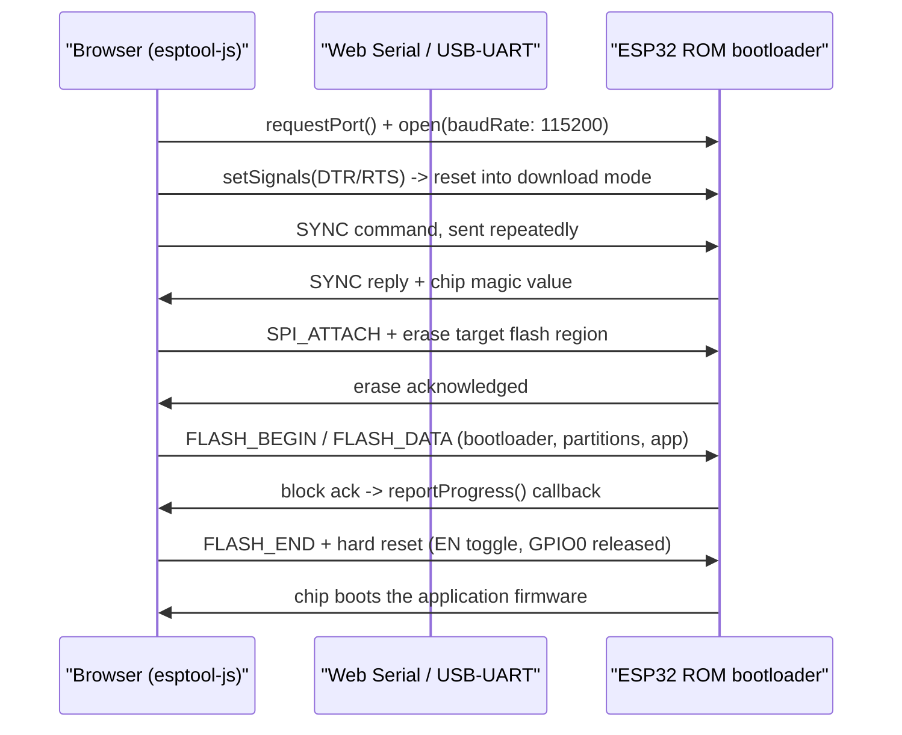
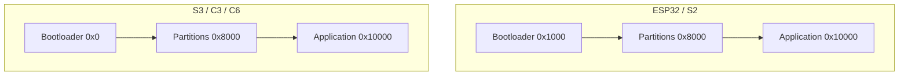

Flashing an ESP32 has traditionally meant installing `esptool.py`, wiring up a Python environment, and running a command line tool against a serial port. The **Web Serial API** collapses that whole chain into a browser tab: a web page can open a real serial connection to a USB-attached device, speak the ROM bootloader's binary protocol, and write firmware directly to flash — no native app, no driver-side installer beyond the USB-UART chip driver itself. This tutorial builds that page from scratch, using [esptool-js](https://github.com/espressif/esptool-js), the JavaScript port of Espressif's own `esptool.py`, and explains exactly what happens on the wire while it runs.

## What the Web Serial API actually gives you

The Web Serial API (`navigator.serial`) is a browser API that exposes host serial ports — including the virtual COM ports created by USB-UART bridge chips like the Silicon Labs CP2102 or the WCH CH340/CH9102 found on almost every ESP32 dev board — to JavaScript running in a page. It gives you `requestPort()` to let the user pick a device from a native OS picker, and a `SerialPort` object with `open()`, `readable`, `writable`, and `getSignals()`/`setSignals()` for the DTR/RTS lines that reset an ESP32 into its bootloader.

Two constraints matter before you write a line of code:

- It only works in **Chromium-based desktop browsers** — Chrome, Edge, Opera, Brave. Chrome for Android also supports it if the phone has USB OTG. Firefox and Safari do not implement it and have no public plans to.
- It requires a **secure context**: the page must be served over HTTPS, or from `localhost` during development. It will not run from a plain `file://` path or unencrypted HTTP.

| Browser | Platform | Web Serial support |
| --- | --- | --- |
| Chrome / Chromium | Windows, macOS, Linux, ChromeOS | Yes, since v89 |
| Microsoft Edge | Windows, macOS | Yes (Chromium-based) |
| Opera | Desktop | Yes |
| Chrome for Android | Android | Yes, with a USB OTG cable |
| Firefox | All | No |
| Safari | macOS, iOS | No |

> **Note:** `requestPort()` must be called from inside a user gesture handler — a click event, for example. Calling it on page load will throw a `SecurityError`.

## How ESP32 flashing actually works

Every ESP32 has a small first-stage bootloader burned into ROM that never changes. On power-up (or reset), two strapping pins decide what it does: if `GPIO0` is held low while the chip comes out of reset, the ROM enters **UART download mode** instead of booting the flash image. In that mode it speaks a simple framed, slip-encoded serial protocol — the same protocol `esptool.py` has spoken for a decade — that supports commands like `SYNC`, `FLASH_BEGIN`, `FLASH_DATA`, `FLASH_END`, and `MEM_WRITE`.

Most dev boards (anything with a CP2102 or CH340 and an "auto-program" circuit — NodeMCU-style boards, most DevKitC clones) wire the USB-UART bridge's DTR and RTS lines to the ESP32's `EN` (reset) and `GPIO0` (boot-select) pins through a small RC network. Toggling DTR/RTS in the right sequence pulses `EN` low while holding `GPIO0` low, which drops the chip straight into download mode without anyone touching a button. This is exactly what `esptool.py` does over a regular serial connection, and it is exactly what the Web Serial API lets a browser do too, via `SerialPort.setSignals({ dataTerminalReady, requestToSend })`.

Once the chip is in download mode, the host (browser or Python) sends a `SYNC` frame repeatedly until the ROM answers, reads back a chip-identifying magic value to determine which ESP32 variant it's talking to, optionally negotiates a higher baud rate, erases the target flash region, and then streams the firmware in `FLASH_DATA` blocks. After the last block, a `FLASH_END` command with the "reboot" flag set, or a manual EN toggle, resets the chip — this time with `GPIO0` released — so it boots the new image normally.



*The esptool wire protocol as seen from the browser: sync, erase, stream flash blocks, then reset out of download mode.*

## Prerequisites

- An ESP32 (or ESP32-S2/S3/C3/C6) development board with a USB-UART bridge on it, and a USB cable that carries data (not a charge-only cable).
- The correct USB-UART driver installed on your machine: **CP210x** (Silicon Labs) for most Espressif DevKits, or **CH340/CH341/CH9102** (WCH) for many third-party boards. Windows and Linux distros often need these installed manually; macOS usually pulls them in automatically on first plug-in for CP210x, but WCH chips may still need a kext/driver.
- Chrome, Edge, or another Chromium-based browser, recent version.
- Node.js 18+ and `npm` if you want to bundle esptool-js locally, or nothing at all if you use the CDN import shown below.
- Your firmware as raw `.bin` files — a **bootloader** binary, a **partition table** binary, and an **application** binary — or a single pre-merged image. If you build with ESP-IDF, these are produced under `build/bootloader/bootloader.bin`, `build/partition_table/partition-table.bin`, and `build/<project>.bin`. With Arduino/PlatformIO, the equivalent files live under `.pio/build/<env>/`.

> **Tip:** if you'd rather flash a single file, run `esptool.py --chip esp32 merge_bin -o merged-firmware.bin --flash_mode dio --flash_freq 40m --flash_size 4MB 0x1000 bootloader.bin 0x8000 partition-table.bin 0x10000 app.bin` once, offline, and write that one blob at offset `0x0` from the browser instead of three separate files.

## Step 1: Know your flash offsets

Every ESP32 variant boots the same three images — bootloader, partition table, application — but the bootloader's flash offset differs by chip family, because newer chips moved the ROM's expected bootloader load address down to `0x0`. Getting this wrong is the single most common cause of a "flashed but nothing happens" failure.

| Chip | Bootloader offset | Partition table offset | Application offset |
| --- | --- | --- | --- |
| ESP32 | `0x1000` | `0x8000` | `0x10000` |
| ESP32-S2 | `0x1000` | `0x8000` | `0x10000` |
| ESP32-S3 | `0x0` | `0x8000` | `0x10000` |
| ESP32-C3 | `0x0` | `0x8000` | `0x10000` |
| ESP32-C6 / H2 | `0x0` | `0x8000` | `0x10000` |

The partition table and application offsets are the same across the whole family by default; only the bootloader moves. If your project overrides `CONFIG_PARTITION_TABLE_OFFSET` in `sdkconfig`, or uses a custom partitions CSV with a non-default app offset, use those values instead — the offsets baked into your build's `flasher_args.json` (ESP-IDF projects generate this file in `build/`) are always authoritative for your specific project.



*The bootloader's offset is the only thing that changes between chip families; partition table and app offsets stay put.*

## Step 2: Set up the project

You don't need a bundler to try this. esptool-js ships as an ES module, so you can import it straight from a CDN in a plain `<script type="module">`:

```javascript
import { ESPLoader, Transport } from "https://esm.sh/esptool-js@0.4.5";
```

For anything beyond a quick prototype, install it properly and let your bundler (Vite, esbuild, webpack) handle resolution and tree-shaking:

```bash
mkdir esp32-web-flasher && cd esp32-web-flasher
npm init -y
npm install esptool-js
npm install -D vite
```

Drop your three firmware binaries into a `firmware/` folder next to `index.html`:

```bash
esp32-web-flasher/
├── index.html
├── main.js
└── firmware/
    ├── bootloader.bin
    ├── partition-table.bin
    └── app.bin
```

## Step 3: Build the page

The page itself is minimal — a connect button, a flash button, and a log area. esptool-js writes progress and status lines through a `terminal` object you provide, so wiring that to a `<pre>` element gives you a live console for free.

```html
<!doctype html>
<html lang="en">
  <head>
    <meta charset="utf-8" />
    <title>ESP32 Web Flasher</title>
  </head>
  <body>
    <h1>ESP32 Web Flasher</h1>
    <button id="connect">Connect</button>
    <button id="flash" disabled>Flash Firmware</button>
    <pre id="log"></pre>
    <script type="module" src="./main.js"></script>
  </body>
</html>
```

## Step 4: Connect and identify the chip

The connect handler does three things: ask the browser for a port, wrap that port in esptool-js's `Transport`, and hand the transport to an `ESPLoader`. Calling `main()` on the loader performs the DTR/RTS reset sequence, sends the sync frames, and returns a human-readable chip description once it gets a reply.

```javascript
import { ESPLoader, Transport } from "esptool-js";

const logEl = document.getElementById("log");
const connectBtn = document.getElementById("connect");
const flashBtn = document.getElementById("flash");

let esploader;
let transport;

function log(line) {
  logEl.textContent += line + "\n";
  logEl.scrollTop = logEl.scrollHeight;
}

connectBtn.addEventListener("click", async () => {
  if (!("serial" in navigator)) {
    log("Web Serial API is not available in this browser.");
    return;
  }

  try {
    const device = await navigator.serial.requestPort();
    transport = new Transport(device, true);

    esploader = new ESPLoader({
      transport,
      baudrate: 115200,
      romBaudrate: 115200,
      terminal: {
        clean: () => (logEl.textContent = ""),
        writeLine: (data) => log(data),
        write: (data) => (logEl.textContent += data),
      },
    });

    const chip = await esploader.main();
    log(`Connected to ${chip}`);
    flashBtn.disabled = false;
  } catch (err) {
    log(`Connection failed: ${err.message}`);
  }
});
```

`main()` is doing the sync-and-identify handshake shown in the sequence diagram above; by the time it resolves, the chip is sitting in download mode waiting for flash commands.

## Step 5: Erase and write the flash

esptool-js wants each file's raw bytes as a JavaScript "binary string" (one character per byte), paired with the flash address it belongs at. `writeFlash()` takes a `fileArray` of these pairs, plus a `reportProgress` callback fired per block per file — exactly what you need to drive a progress bar.

```javascript
async function fetchBinaryString(path) {
  const response = await fetch(path);
  const bytes = new Uint8Array(await response.arrayBuffer());
  let result = "";
  for (let i = 0; i < bytes.length; i++) {
    result += String.fromCharCode(bytes[i]);
  }
  return result;
}

flashBtn.addEventListener("click", async () => {
  flashBtn.disabled = true;

  const [bootloader, partitions, app] = await Promise.all([
    fetchBinaryString("./firmware/bootloader.bin"),
    fetchBinaryString("./firmware/partition-table.bin"),
    fetchBinaryString("./firmware/app.bin"),
  ]);

  const fileArray = [
    { data: bootloader, address: 0x1000 },   // 0x0 on S3/C3/C6
    { data: partitions, address: 0x8000 },
    { data: app, address: 0x10000 },
  ];

  try {
    log("Erasing flash...");
    await esploader.eraseFlash();

    await esploader.writeFlash({
      fileArray,
      flashSize: "keep",
      flashMode: "keep",
      flashFreq: "keep",
      eraseAll: false,
      compress: true,
      reportProgress: (fileIndex, written, total) => {
        const pct = Math.round((written / total) * 100);
        log(`File ${fileIndex + 1}/${fileArray.length}: ${pct}%`);
      },
    });

    log("Flash complete. Resetting device...");
    await esploader.hardReset();
    await transport.disconnect();
  } catch (err) {
    log(`Flashing failed: ${err.message}`);
  } finally {
    flashBtn.disabled = false;
  }
});
```

A few details worth calling out: `flashSize: "keep"` tells esptool-js not to rewrite the size byte embedded in the bootloader image, which is what you want unless you're deliberately overriding the detected flash chip size. `compress: true` gzips each block before sending it, which noticeably speeds up flashing over a slow USB-serial link. And `hardReset()` at the end is what takes the chip out of download mode and lets the freshly written application boot — without it, the board sits waiting for more serial commands until you power-cycle it manually.

If you built a single merged image instead of three separate files, this collapses to one entry: `{ data: mergedBinaryString, address: 0x0 }`.

## Troubleshooting

- **No port shows up in the picker.** The OS doesn't see a serial device at all, which almost always means the USB-UART driver isn't installed. Check Device Manager (Windows) or `ls /dev/tty.*` (macOS) / `ls /dev/ttyUSB* /dev/ttyACM*` (Linux) for a CP210x or CH340 entry. If nothing shows even at the OS level, install the Silicon Labs CP210x VCP driver or the WCH CH340/CH9102 driver for your platform, then replug the board.
- **Board never enters download mode ("Failed to connect" after several sync retries).** Some boards — particularly bare modules, breakout boards without an auto-program circuit, or boards behind certain USB hubs — can't be reset into bootloader mode purely via DTR/RTS. Hold the **BOOT** (IO0) button, tap **EN** (reset) once while still holding BOOT, then release BOOT after a second. Click connect again while the chip is held in that state.
- **"Failed to open serial port" / NetworkError / port busy.** Something else already has the port open — the Arduino IDE's Serial Monitor, `idf.py monitor`, PlatformIO's monitor, or a lingering `screen`/`minicom` session. Close it; only one process can own a serial port at a time. On Linux, also confirm your user is in the `dialout` (Debian/Ubuntu) or `uucp` (Arch) group, or you'll get a permission error before you even get that far.
- **Page loads but `navigator.serial` is undefined.** You're either on a non-Chromium browser (Firefox, Safari) or serving the page over plain HTTP from a non-localhost origin. Web Serial requires a secure context — deploy behind HTTPS or test from `http://localhost`.
- **Sync succeeds but flashing is slow or drops mid-write.** Try a lower baud rate first — 115200 is the safest default; some CH340 clones and long/cheap USB cables can't sustain the higher rates (`921600`+) that esptool-js may negotiate after sync. Also verify the USB cable actually carries data — many phone-charging cables are power-only and will enumerate a port that never talks.
- **Flash completes but the board doesn't boot the new firmware.** Double-check the bootloader offset against the chip table above — writing an ESP32 bootloader at `0x1000` to an ESP32-S3, which expects it at `0x0`, produces a board that looks flashed but never runs anything.

## Wrap-up

The Web Serial API plus esptool-js reproduce the exact protocol `esptool.py` has used for years, just running inside a browser tab instead of a Python process: request a port, drop the chip into its ROM bootloader via DTR/RTS, sync, erase, stream the bootloader/partition-table/application images to their offsets, and hard-reset. Once you have `requestPort()`, `Transport`, and `ESPLoader` wired up as shown here, extending it — a device picker for multiple chip families, a drag-and-drop zone for custom binaries, a progress bar bound to `reportProgress` — is ordinary front-end work layered on top of a protocol that hasn't changed in years.
