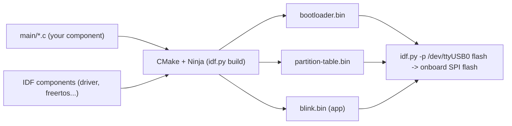

ESP-IDF (Espressif IoT Development Framework) is the official SDK for building firmware on the ESP32 family of microcontrollers. It bundles a CMake-based build system, the xtensa/riscv cross-compiler toolchains, a FreeRTOS port, and a large tree of drivers and networking components (Wi-Fi, Bluetooth, TCP/IP) behind a consistent set of C APIs. This walkthrough takes you from a bare checkout to a blinking LED you built and flashed yourself, using nothing but the standard tools Espressif ships.

## What you're actually installing

ESP-IDF is not a single binary — it's a git repository containing the framework source plus an installer script that pulls down a matching toolchain (compiler, debugger, CMake, Ninja, and a Python virtual environment) into a per-version directory under `~/.espressif`. Your project source stays separate from all of that; each shell session just needs to "activate" the right toolchain via an export script, the same way you'd activate a Python virtualenv.

Two build-system pieces matter conceptually before you touch a keyboard:

- **CMake + Ninja** drive the actual compilation. ESP-IDF wraps CMake in a Python front-end called `idf.py` so you rarely invoke `cmake` directly.
- **FreeRTOS** is the real-time kernel every ESP-IDF app runs on top of. Even the simplest "hello world" boots into a FreeRTOS task — there is no bare-metal `main()` loop.

## Prerequisites

You can develop on Linux, macOS, or Windows; this guide uses Linux/macOS shell syntax (Windows users get an equivalent PowerShell/cmd installer from Espressif's docs). You'll need:

- **Python 3.9+** — the installer creates its own virtual environment, so a system Python is enough.
- **git** — ESP-IDF and its submodules are cloned directly from GitHub.
- **Build essentials** — a C compiler, `cmake`, and `ninja-build` are pulled in by the installer on Linux, but the OS-level dependencies (like `libusb`) need to already be present.
- **A USB-UART driver** — most ESP32 dev boards use either a CP2102 or CH340 USB-to-serial chip. Linux and modern macOS usually have these built in; older macOS versions need a driver download from Silicon Labs (CP2102) or WCH (CH340).
- **An ESP32 dev board** and a USB cable that actually carries data (not a charge-only cable — a surprisingly common gotcha).

On Debian/Ubuntu, install the OS packages the installer expects:

```bash
sudo apt-get update
sudo apt-get install -y git wget flex bison gperf python3 python3-pip \
  python3-venv cmake ninja-build ccache libffi-dev libssl-dev dfu-util \
  libusb-1.0-0
```

On macOS with Homebrew:

```bash
brew install cmake ninja dfu-util python3
```

## Installing ESP-IDF

Clone the framework into a dedicated directory — `~/esp` is the convention Espressif's own docs use, and keeping it out of your project tree matters because the repo is large (hundreds of MB with submodules) and versioned independently of any single firmware project:

```bash
mkdir -p ~/esp
cd ~/esp
git clone -b v5.4 --recursive https://github.com/espressif/esp-idf.git
```

The `-b v5.4` pins a stable release branch rather than tracking `master`, and `--recursive` pulls in the dozens of submodules (lwIP, mbedTLS, the BLE stack, etc.) that the framework vendors. If you forget `--recursive`, run `git submodule update --init --recursive` afterward — a checkout without submodules will fail to build with confusing "file not found" errors deep in the component tree.

Next, run the install script. It downloads the correct compiler toolchain for your host OS and target chip, and creates a Python virtual environment with all of ESP-IDF's Python dependencies (used by `idf.py`, the size analyzer, the monitor tool, and so on):

```bash
cd ~/esp/esp-idf
./install.sh esp32
```

Passing `esp32` limits the toolchain download to that one chip family. If you plan to also target the ESP32-S3 or ESP32-C3 later, you can install multiple targets at once: `./install.sh esp32,esp32s3,esp32c3`, or just `./install.sh all` for everything.

### Activating the environment

The install step only downloads files — it doesn't change your shell. Every new terminal session needs to source the export script before `idf.py` is on your `PATH`:

```bash
. $HOME/esp/esp-idf/export.sh
```

This script does three things worth understanding, because they explain most "command not found" problems later:

- It sets `IDF_PATH` to the framework checkout, which the build system uses to locate core components.
- It prepends the downloaded toolchain (compiler, `cmake`, `ninja`) and the `idf-env` virtualenv's `bin/` to your `PATH`.
- It enables tab-completion for `idf.py` in bash/zsh.

Since sourcing a full path gets tedious, add an alias to your shell profile (`~/.bashrc` or `~/.zshrc`):

```bash
alias get_idf='. $HOME/esp/esp-idf/export.sh'
```

Now any new shell just needs `get_idf` before running `idf.py`. Verify it worked:

```bash
idf.py --version
```

> **Note:** the export script only affects the current shell process. Opening a new terminal tab, tmux pane, or SSH session means running `get_idf` again — it is not a permanent PATH change.

## Creating a project

ESP-IDF ships example projects inside the checkout; the fastest way to get moving is to copy one out of the tree rather than build inside the read-only examples directory:

```bash
cp -r $IDF_PATH/examples/get-started/hello_world ~/esp/hello_world
cd ~/esp/hello_world
```

But it's worth building the equivalent project from scratch once, so the pieces aren't magic. A minimal ESP-IDF project has exactly three files:

```bash
blink/
├── CMakeLists.txt
└── main/
    ├── CMakeLists.txt
    └── main.c
```

The top-level `CMakeLists.txt` is boilerplate that pulls in ESP-IDF's build logic and names the resulting project:

```cmake
cmake_minimum_required(VERSION 3.16)
include($ENV{IDF_PATH}/tools/cmake/project.cmake)
project(blink)
```

The `main/CMakeLists.txt` registers `main` as an ESP-IDF *component* — the framework's unit of modular source code — and declares which other components it needs:

```cmake
idf_component_register(SRCS "main.c"
                        INCLUDE_DIRS "."
                        REQUIRES driver)
```

`REQUIRES driver` pulls in the GPIO driver component so `main.c` can call `gpio_set_direction` and `gpio_set_level`. If you add more components later (Wi-Fi, NVS, HTTP client), you list them here rather than guessing at a global include path — ESP-IDF's build graph is explicit about component dependencies.

### Writing main.c

Every ESP-IDF app's entry point is `app_main()`, called by the framework's own startup code after FreeRTOS and the hardware abstraction layer are initialized. It runs as a FreeRTOS task itself, so it's normal for it to either return (the task is then deleted) or spawn more tasks and return immediately. This example blinks an LED on GPIO 2 — the onboard LED pin on many common ESP32 dev boards — from a dedicated task:

```c
#include <stdio.h>
#include "freertos/FreeRTOS.h"
#include "freertos/task.h"
#include "driver/gpio.h"
#include "esp_log.h"

#define BLINK_GPIO GPIO_NUM_2

static const char *TAG = "blink";

static void blink_task(void *arg)
{
    gpio_reset_pin(BLINK_GPIO);
    gpio_set_direction(BLINK_GPIO, GPIO_MODE_OUTPUT);

    bool level = false;
    while (1) {
        level = !level;
        gpio_set_level(BLINK_GPIO, level);
        ESP_LOGI(TAG, "LED %s", level ? "ON" : "OFF");
        vTaskDelay(pdMS_TO_TICKS(500));
    }
}

void app_main(void)
{
    ESP_LOGI(TAG, "starting blink task");
    xTaskCreate(blink_task, "blink_task", 2048, NULL, 5, NULL);
}
```

A few things worth calling out for anyone new to embedded C on FreeRTOS:

- `xTaskCreate`'s fourth argument is the stack size *in bytes* here (2048), the fifth is task priority (higher numbers preempt lower ones), and the last is an optional handle for later control (deleting/suspending the task).
- `vTaskDelay(pdMS_TO_TICKS(500))` is the correct way to sleep in a FreeRTOS task — never call a busy-wait loop, since that would starve the scheduler's tick and other tasks (including the idle task that feeds the watchdog).
- `ESP_LOGI` is ESP-IDF's tagged logging macro; it writes to the same UART used for flashing, which is why `idf.py monitor` can show it live.

## Project anatomy

Once you build (next section), the directory fills in with generated files. Here's what belongs to you versus what the tooling owns:

- **`main/`** — your application code, treated as a component like any other. Nothing stops you from splitting logic into additional components under a top-level `components/` directory as the project grows.
- **`sdkconfig`** — the fully resolved build configuration (Wi-Fi buffer sizes, log verbosity, partition table choice, stack sizes, and hundreds of other Kconfig options), generated the first time you run `idf.py menuconfig` or `idf.py build`. This file is project-specific and typically checked into version control.
- **`sdkconfig.defaults`** — an optional file *you* maintain with just the handful of options you actually want to override from stock defaults. It's applied on top of the component defaults whenever `sdkconfig` is regenerated, which makes config changes reviewable in diffs instead of buried in a 2000-line generated file.
- **`build/`** — entirely generated (CMake cache, Ninja files, object files, and the final `.bin`/`.elf` artifacts). Safe to delete any time; `idf.py build` regenerates it.
- **`dependencies.lock`** — if your project pulls components from the ESP Component Registry via `idf_component.yml`, this pins their resolved versions.



*Your component and the framework's components compile together under CMake/Ninja into three separate binaries, which the flash tool writes to their own offsets in one pass.*

## Building, flashing, and monitoring

First, tell the build system which chip you're targeting. This selects the correct toolchain, default partition layout, and Kconfig options, and it generates (or regenerates) `sdkconfig`:

```bash
idf.py set-target esp32
```

Optionally open the configuration menu to browse or change Kconfig options — for a blink example you don't strictly need to touch anything, but it's worth knowing this is where you'd raise the default log level, change the main task stack size, or pick a different partition table:

```bash
idf.py menuconfig
```

This opens a terminal UI (ncurses-based). Any change you make is written into `sdkconfig` immediately on save — there's no separate "apply" step.

Now build:

```bash
idf.py build
```

The first build compiles the entire framework tree you depend on and takes a couple of minutes; incremental builds after that only recompile changed files and finish in seconds. A successful run ends with a summary of binary sizes and the exact `esptool.py` invocation it would use to flash.

Plug in the board and find its serial device. On Linux it's typically `/dev/ttyUSB0` or `/dev/ttyACM0`; on macOS it looks like `/dev/cu.usbserial-0001`. Flash it:

```bash
idf.py -p /dev/ttyUSB0 flash
```

Then watch the serial output — this attaches a terminal to the same UART and decodes crash backtraces symbolically using the just-built `.elf`:

```bash
idf.py -p /dev/ttyUSB0 monitor
```

You should see the `ESP_LOGI` lines from `blink_task` scrolling by every half second. Exit the monitor with `Ctrl-]`. In practice you'll run these two steps together constantly, so use the combined form:

```bash
idf.py -p /dev/ttyUSB0 flash monitor
```

| Command | What it does |
| --- | --- |
| `idf.py set-target esp32` | Selects the target chip; regenerates `sdkconfig` defaults |
| `idf.py menuconfig` | Interactive Kconfig editor for build/runtime options |
| `idf.py build` | Compiles all components and links bootloader/app/partition table |
| `idf.py -p PORT flash` | Writes the built binaries to the board over serial |
| `idf.py -p PORT monitor` | Opens a live, symbol-decoding serial log viewer (exit: Ctrl-]) |
| `idf.py -p PORT flash monitor` | Flashes, then immediately opens the monitor |
| `idf.py size` | Prints a breakdown of flash and RAM usage per component |
| `idf.py fullclean` | Deletes the `build/` directory and CMake cache entirely |

### Where the bytes actually go

A flash step isn't one binary — it's several, written to fixed offsets defined by the partition table. On a typical ESP32 board with the default (non-encrypted, non-OTA) partition table:

| Offset | Contents | Purpose |
| --- | --- | --- |
| `0x1000` | bootloader.bin | Second-stage bootloader; initializes flash/PSRAM and loads the partition table |
| `0x8000` | partition-table.bin | Compact binary map of where every other partition (app, NVS, etc.) lives |
| `0x10000` | blink.bin (app) | Your compiled application image, the largest of the three |

You can see this exact layout, and edit it, in the CSV file referenced by `sdkconfig`'s partition table option (`partitions.csv` for a custom table). Run `idf.py partition-table` to print the resolved layout for your current build.

## Troubleshooting

- **`idf.py: command not found`** — the export script wasn't sourced in this shell. Run your `get_idf` alias (or `. ~/esp/esp-idf/export.sh` directly) and retry; remember this is per-shell, not permanent.
- **`Permission denied` opening `/dev/ttyUSB0`** — on Linux your user usually isn't in the group that owns serial devices (commonly `dialout`, sometimes `uucp`). Fix it once with `sudo usermod -aG dialout $USER`, then log out and back in (group membership doesn't apply to already-open shells). If it still fails, check `ls -l /dev/ttyUSB0` to confirm the owning group.
- **Wrong target error at build time** — mixing chips (building for esp32 with an esp32-s3 board plugged in, or vice versa) fails during flashing with a chip-ID mismatch, not at compile time. Re-run `idf.py set-target <chip>` and rebuild; this regenerates `sdkconfig`, so back up local menuconfig changes first if you made any.
- **Port not found** — if no `/dev/ttyUSB*` or `/dev/ttyACM*` appears after plugging in, the USB-UART driver isn't loaded. On Linux, run `dmesg | tail` right after plugging in to see whether the kernel even recognized the chip; on macOS, install the CP2102 or CH340 driver depending on which USB bridge chip your board uses (check the chip printed on the board near the USB connector).
- **Monitor shows garbage characters** — almost always a baud rate or port mismatch. The default monitor baud is 115200, matching the bootloader's console; if you changed `CONFIG_ESPTOOLPY_MONITOR_BAUD` in menuconfig, make sure both sides agree. Garbage right after a reset (rather than throughout) is normal — it's the bootloader banner before the log formatter locks on.
- **Build behaves like it ignored your changes** — stale CMake cache after switching branches, editing `CMakeLists.txt` component lists, or moving files around. `idf.py fullclean` wipes `build/` and forces a clean CMake configure + Ninja build.
- **Flashing succeeds but nothing happens** — check you're not still holding the board's BOOT button (needed on some boards to enter the ROM bootloader for flashing, but must be released afterward), and confirm the reset happens automatically — most dev boards wire DTR/RTS for auto-reset, but some require a manual button press after `flash` completes.

## Wrap-up

From here the same loop — `set-target`, edit `main.c`, `build`, `flash monitor` — scales up to real projects: add `REQUIRES` entries as you pull in more drivers, split logic into additional components under `components/`, and lean on `menuconfig` plus a curated `sdkconfig.defaults` to keep configuration reviewable. The GPIO/FreeRTOS pattern in the blink task above — a dedicated task, `vTaskDelay` for timing, tagged `ESP_LOGI` for visibility — is the same shape you'll reuse for reading sensors, driving displays, or handling network events, just with different driver headers and a longer `REQUIRES` list.
