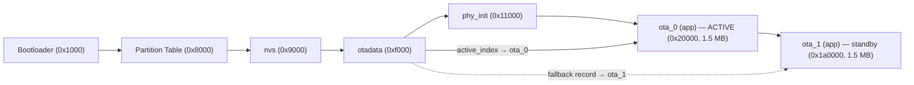
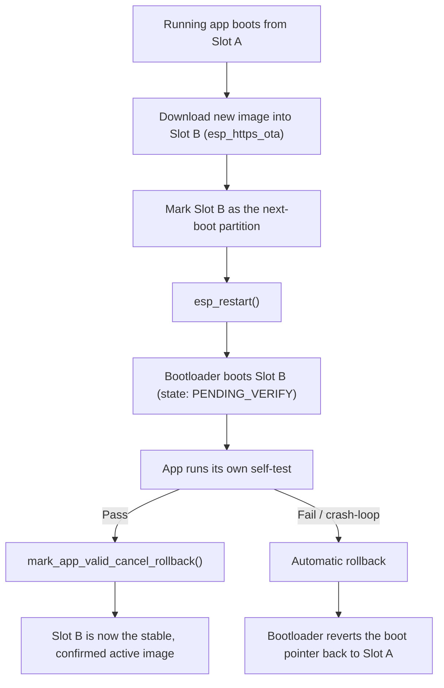

Flashing a board over USB works fine on your desk. It stops working the moment that board is bolted to a wall, potted in resin, or sitting in a customer's garage two states away. Over-the-air (OTA) updates solve this by letting a running ESP32 download its own successor, boot into it, and quietly discard the old version once the new one proves itself. This post builds that pipeline from scratch on ESP-IDF v5.x: the partition layout that makes it possible, the `esp_https_ota` code that drives a download, and the rollback logic that keeps a bad build from bricking the fleet.

## Why OTA Needs Two Copies of the App

The naive approach — erase the running app and write the new one in place — is exactly how you turn a remote device into a paperweight. If power drops, the connection stalls, or the new binary is simply broken, there is no old version left to fall back to. Every production-grade OTA scheme on the ESP32 avoids this with an A/B (dual-slot) layout: the flash holds *two* copies of the application, and the device always downloads into whichever one it is not currently running. The currently-booted image is never touched until its replacement has been written, verified, and proven to boot correctly.

A small partition called `otadata` is what makes this a coherent scheme rather than a race condition. It does not hold firmware — it holds two 32-byte records, each with a sequence number, that say "the next thing to boot is this slot." The second-stage bootloader reads `otadata` on every boot and jumps to whichever app partition it points at. Update logic never touches the bootloader itself; it only ever writes a new app image and flips this pointer.

## The Dual-Slot Layout

The default "factory" partition table that `idf.py create-project` generates has no OTA support at all — one app partition, no `otadata`. To get OTA you supply a custom `partitions.csv` with at least two app slots plus the `otadata` partition. Here is a layout for a device with 4 MB of flash and no need for a factory-only recovery partition:

```ini
# Name,     Type,  SubType, Offset,    Size,      Flags
nvs,        data,  nvs,     0x9000,    0x6000,
otadata,    data,  ota,     0xf000,    0x2000,
phy_init,   data,  phy,     0x11000,   0x1000,
ota_0,      app,   ota_0,   0x20000,   0x180000,
ota_1,      app,   ota_1,   0x1a0000,  0x180000,
```

The `ota_0`/`ota_1` subtypes are what tell `esp_ota_ops` "these two are a matched pair, cycle between them." You could keep the stock `factory` partition alongside them as a permanent fallback image that OTA never overwrites, but on a device that ships with OTA from day one, two equally-sized OTA slots is simpler and gives you the full 1.5 MB per slot shown above rather than splitting it three ways.

| Partition | Type / Subtype | Offset | Size | Purpose |
|---|---|---|---|---|
| bootloader | — | 0x1000 | ~28 KB | Second-stage bootloader; reads `otadata`, jumps to the active app |
| partition table | — | 0x8000 | 3 KB | The compiled form of `partitions.csv` |
| nvs | data / nvs | 0x9000 | 24 KB | Wi-Fi credentials, app key-value storage |
| otadata | data / ota | 0xf000 | 8 KB | Two redundant records: which slot to boot next |
| phy_init | data / phy | 0x11000 | 4 KB | RF calibration data |
| ota_0 | app / ota_0 | 0x20000 | 1.5 MB | Application slot A |
| ota_1 | app / ota_1 | 0x1a0000 | 1.5 MB | Application slot B |

Point `idf.py menuconfig` at this file under **Partition Table → Custom partition table CSV**, or set it directly in `sdkconfig`:

```ini
CONFIG_PARTITION_TABLE_CUSTOM=y
CONFIG_PARTITION_TABLE_CUSTOM_FILENAME="partitions.csv"
CONFIG_PARTITION_TABLE_OFFSET=0x8000
```



*otadata holds two redundant records; the bootloader follows whichever one has the higher sequence number to pick the active app slot.*

## Enabling Rollback

Rollback is the safety net that makes the A/B scheme worth building: if a freshly-flashed image never confirms it's healthy, the bootloader automatically reverts to the previous slot on the next boot instead of retrying the broken one forever. It is off by default and needs two things turned on in `menuconfig`:

```ini
# Bootloader config
CONFIG_BOOTLOADER_APP_ROLLBACK_ENABLE=y

# Component config → App Rollback / secure version, optional but recommended
CONFIG_BOOTLOADER_APP_ANTI_ROLLBACK=y
```

> Exact Kconfig symbol names shift slightly between IDF minor versions — search `menuconfig` for "rollback" rather than hand-editing `sdkconfig` blind.

`CONFIG_BOOTLOADER_APP_ROLLBACK_ENABLE` is the one that matters for basic safety: it makes every freshly-booted OTA image start in a `PENDING_VERIFY` state, which the running app must explicitly confirm (covered below) or the bootloader treats the next boot as a failure and switches back.

`CONFIG_BOOTLOADER_APP_ANTI_ROLLBACK` is a stricter, one-way variant: each image embeds a monotonically increasing "secure version" number, and the bootloader refuses to boot — or even accept, during OTA — any image whose secure version is lower than one it has already run. This stops an attacker (or a clumsy fleet operator) from downgrading a device to a build with a known vulnerability. Enable it once your update process actually tracks secure versions deliberately; it is irreversible per-device once a version has been accepted.

## Implementing OTA with esp_https_ota

ESP-IDF's `esp_https_ota` component wraps `esp_http_client` and `esp_ota_ops` into a download-and-write pipeline. There are two ways to drive it: a single blocking call for the common case, and a handle-based loop when you need progress reporting or want to inspect the new image before committing to it.

### The simple path: one call, one reboot

```c
#include "esp_https_ota.h"
#include "esp_ota_ops.h"
#include "esp_log.h"

static const char *TAG = "ota";

extern const uint8_t server_cert_pem_start[] asm("_binary_ca_cert_pem_start");
extern const uint8_t server_cert_pem_end[]   asm("_binary_ca_cert_pem_end");

void run_ota_update(const char *url)
{
    esp_http_client_config_t http_config = {
        .url = url,
        .cert_pem = (char *)server_cert_pem_start,
        .timeout_ms = 10000,
        .keep_alive_enable = true,
    };

    esp_https_ota_config_t ota_config = {
        .http_config = &http_config,
    };

    ESP_LOGI(TAG, "Starting OTA from %s", url);
    esp_err_t err = esp_https_ota(&ota_config);
    if (err == ESP_OK) {
        ESP_LOGI(TAG, "OTA succeeded, rebooting");
        esp_restart();
    } else {
        ESP_LOGE(TAG, "OTA failed: %s", esp_err_to_name(err));
    }
}
```

The certificate is pulled in with `EMBED_TXTFILES` in the component's `CMakeLists.txt`, which turns the PEM file into linked-in symbols:

```cpp
idf_component_register(SRCS "main.c"
                        INCLUDE_DIRS "."
                        EMBED_TXTFILES "certs/ca_cert.pem")
```

If you'd rather trust the standard public CA bundle (fine when the update server has a normal Let's Encrypt-style cert) swap `cert_pem` for `.crt_bundle_attach = esp_crt_bundle_attach` and enable `CONFIG_MBEDTLS_CERTIFICATE_BUNDLE` in `menuconfig` — one less thing to embed and rotate manually.

### The advanced path: progress and a version check

`esp_https_ota()` is fine when you just want the update applied. The handle-based API lets you read the new image's `esp_app_desc_t` before a single byte of flash is written, so you can skip a redundant download, and lets you report bytes-written as it goes:

```c
#include "esp_https_ota.h"
#include "esp_app_desc.h"
#include <string.h>

static const char *TAG = "ota";

esp_err_t run_ota_with_progress(const char *url)
{
    esp_http_client_config_t http_config = {
        .url = url,
        .crt_bundle_attach = esp_crt_bundle_attach,
        .timeout_ms = 10000,
    };
    esp_https_ota_config_t ota_config = {
        .http_config = &http_config,
        .partial_http_download = true,
        .max_http_request_size = 4096,
    };

    esp_https_ota_handle_t handle = NULL;
    esp_err_t err = esp_https_ota_begin(&ota_config, &handle);
    if (err != ESP_OK) {
        return err;
    }

    esp_app_desc_t new_desc;
    err = esp_https_ota_get_img_desc(handle, &new_desc);
    if (err != ESP_OK) {
        esp_https_ota_abort(handle);
        return err;
    }

    const esp_app_desc_t *running_desc = esp_ota_get_app_description();
    if (strcmp(new_desc.version, running_desc->version) == 0) {
        ESP_LOGW(TAG, "Already on version %s, skipping OTA", new_desc.version);
        esp_https_ota_abort(handle);
        return ESP_FAIL;
    }
    ESP_LOGI(TAG, "Updating %s -> %s", running_desc->version, new_desc.version);

    while (1) {
        err = esp_https_ota_perform(handle);
        if (err != ESP_ERR_HTTPS_OTA_IN_PROGRESS) {
            break;
        }
        ESP_LOGI(TAG, "Written %d bytes so far", esp_https_ota_get_image_len_read(handle));
    }

    if (err != ESP_OK || !esp_https_ota_is_complete_data_received(handle)) {
        ESP_LOGE(TAG, "OTA stream incomplete: %s", esp_err_to_name(err));
        esp_https_ota_abort(handle);
        return ESP_FAIL;
    }

    err = esp_https_ota_finish(handle);
    if (err == ESP_OK) {
        esp_restart();
    }
    return err;
}
```

`esp_https_ota_perform()` is deliberately non-blocking-in-spirit: it reads and writes one buffer's worth of data per call and returns `ESP_ERR_HTTPS_OTA_IN_PROGRESS` until the stream ends, which is what gives you a hook to update a progress bar, feed a watchdog, or bail out on a cancel button between chunks.

## Validating the New Image on First Boot

Writing the image and flipping the boot pointer is only half of rollback safety — the new image also has to actively prove it works. With `CONFIG_BOOTLOADER_APP_ROLLBACK_ENABLE` on, every OTA-written image boots into an `ESP_OTA_IMG_PENDING_VERIFY` state. If it never calls back to confirm itself, the *next* reset — including a crash-triggered one — makes the bootloader assume it's broken and switch back to the previous slot automatically.

```c
#include "esp_ota_ops.h"

static bool self_test_passed(void)
{
    // check whatever proves the new build is healthy: Wi-Fi connects,
    // sensors respond, a cloud handshake succeeds, etc.
    return true;
}

void app_main(void)
{
    const esp_partition_t *running = esp_ota_get_running_partition();
    esp_ota_img_states_t ota_state;

    if (esp_ota_get_state_partition(running, &ota_state) == ESP_OK) {
        if (ota_state == ESP_OTA_IMG_PENDING_VERIFY) {
            if (self_test_passed()) {
                ESP_LOGI(TAG, "Self-test passed, marking image valid");
                esp_ota_mark_app_valid_cancel_rollback();
            } else {
                ESP_LOGE(TAG, "Self-test failed, rolling back now");
                esp_ota_mark_app_invalid_rollback_and_reboot();
            }
        }
    }

    // normal application startup continues here
}
```

Keep the self-test fast and bounded — network connectivity, a sensor read, a handshake with your backend. Don't gate it behind anything that can hang forever, or you will never reach either branch and the watchdog will eventually reset you into the rollback path anyway, which is the correct outcome but not the one you wanted.

## Hosting Firmware for Testing

For local development, a plain static file server is enough — `esp_https_ota` just needs a URL that returns the `.bin` bytes:

```bash
mkdir -p ota_server
cp build/ota_demo.bin ota_server/
cd ota_server
python3 -m http.server 8070
```

That serves plain HTTP, which is fine on your bench network but should never be what a device in the field pulls from — firmware is exactly the kind of payload you don't want tampered with in transit. For anything past your desk, put it behind TLS. A self-signed cert is enough to exercise the code path:

```bash
openssl req -x509 -newkey rsa:2048 -nodes \
  -keyout ota.key -out ota.crt \
  -days 365 -subj "/CN=ota.example.com"
```

```ini
server {
    listen 443 ssl;
    server_name ota.example.com;

    ssl_certificate     /etc/nginx/certs/ota.crt;
    ssl_certificate_key /etc/nginx/certs/ota.key;

    location /firmware/ {
        alias /var/www/ota/;
        autoindex on;
    }
}
```

Embed `ota.crt` as `cert_pem` in the firmware exactly as shown above, and point `run_ota_update()` at `https://ota.example.com/firmware/ota_demo.bin`.

## Building, Versioning, and Rolling Out

Set the app version explicitly in the project's top-level `CMakeLists.txt` so `esp_app_desc_t.version` means something — otherwise IDF falls back to a `git describe` string, which is fine for internal builds but awkward to compare programmatically:

```cpp
cmake_minimum_required(VERSION 3.16)
set(PROJECT_VER "1.2.0")
include($ENV{IDF_PATH}/tools/cmake/project.cmake)
project(ota_demo)
```

Then build and flash the first image over USB the normal way:

```bash
idf.py set-target esp32
idf.py build
idf.py -p /dev/ttyUSB0 flash monitor
```

The compiled application binary lands at `build/ota_demo.bin` — bump `PROJECT_VER`, rebuild, and that same path now holds the image you'll serve for the next OTA round. Drop it in the static file directory from the previous section, and trigger `run_ota_update()` from whatever event makes sense for your app: a button press, a scheduled timer, or a command your device already listens for over MQTT or HTTP. The mechanism that decides *when* to update is entirely up to your application; `esp_https_ota` only cares about the URL you hand it.



*The running app never touches its own slot — it writes the update to the other one, hands control to the bootloader, and only survives the next boot if it explicitly confirms itself healthy.*

## Troubleshooting

- **"OTA image too large" / esp_https_ota returns ESP_ERR_OTA_VALIDATE_FAILED at the tail end.** The binary doesn't fit in the target slot. Check `ota_0`/`ota_1` size against your actual `build/*.bin` size (printed at the end of `idf.py build`), and either shrink the app (enable `CONFIG_COMPILER_OPTIMIZATION_SIZE`, trim unused components) or grow the slots in `partitions.csv` — remembering both slots must stay large enough to hold every future build, not just the current one.
- **TLS handshake fails or the connection resets immediately.** Almost always a certificate mismatch: the PEM embedded as `cert_pem` doesn't match what the server presents, or you're using `crt_bundle_attach` against a self-signed cert that isn't in any public CA bundle. Also check the device's clock — TLS certificate validity checks fail silently if `time()` is still at the 1970 epoch because SNTP hasn't synced yet; sync time before starting OTA, not after.
- **Device boot-loops right after an update.** The new image never called `esp_ota_mark_app_valid_cancel_rollback()`. With rollback enabled, an image stuck in `PENDING_VERIFY` that resets for any reason — including a plain crash — gets reverted on the next boot. Make sure the confirmation path in `app_main` actually runs and isn't gated behind something that can hang or crash first.
- **otadata looks corrupted, or the device won't pick the slot you expect.** otadata keeps two redundant records specifically so one bad write doesn't strand the device; if both are damaged, erase the whole partition with `esptool.py erase_region` at its offset and reflash — the bootloader falls back to the lowest-numbered valid app partition when otadata is blank.
- **A known-good older build gets rejected during OTA.** That's anti-rollback (`CONFIG_BOOTLOADER_APP_ANTI_ROLLBACK`) doing its job — it refuses any image whose embedded secure version is lower than one the device has already accepted. This is a one-way ratchet per device; if you need to intentionally downgrade a fleet, that has to be planned around secure versioning, not worked around by disabling the check in the field.

## Wrap-up

The whole scheme rests on three pieces working together: two equally-sized app slots so there's always a known-good fallback, an `otadata` pointer that only flips after a full successful download, and a rollback state machine that demands the new image prove itself before it's trusted permanently. Once `partitions.csv`, the rollback Kconfig options, and the self-test-then-confirm code are in place, the update itself is a small amount of code around `esp_https_ota` — the same handful of calls whether you're pushing one bug fix to a bench unit or rolling a firmware release out to thousands of devices you'll never see again.
