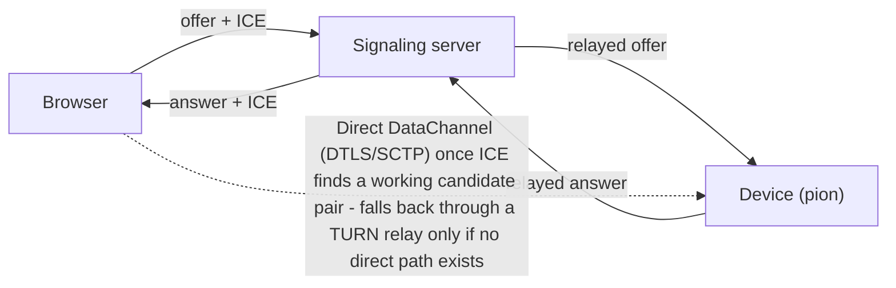
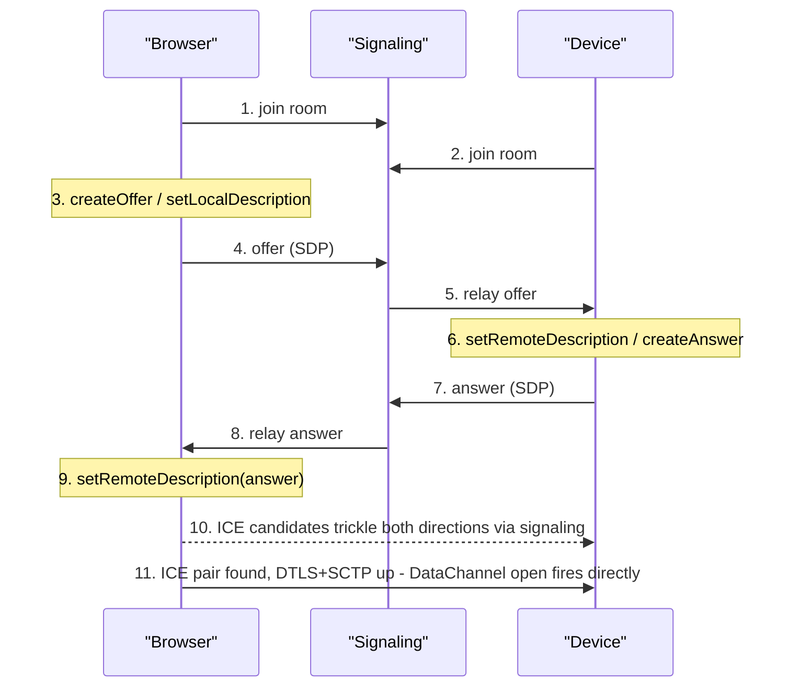

If you have ever built a "connect to my device" feature in a browser, you have probably reached for a relay: the browser opens a WebSocket to your server, the device opens a WebSocket (or MQTT connection) to the same server, and your server shuttles bytes between the two. It works, but every byte pays rent twice — once in, once out — and every round trip adds the latency of a hop that has nothing to do with the actual conversation. WebRTC exists to remove that middleman from the data path while keeping just enough of it around to make the introduction. This post builds that from raw parts: a small Node.js signaling relay, a browser peer, and a Go agent using [pion/webrtc](https://github.com/pion/webrtc), wired together so a browser tab and a device process can open an encrypted, direct data channel and talk without a server in the middle.

## Why bother with peer-to-peer

A relay server is simple to reason about and it is the right choice for a lot of systems, but it has costs that get worse as usage grows. Bandwidth: every message crosses your infrastructure twice, so egress scales with total traffic rather than connection count. Latency: a relay adds at least one extra network hop, and if it sits far from either party, that hop can dominate the round trip. And it's a scaling bottleneck — a thousand simultaneous "browser talking to device" sessions means a thousand simultaneous streams through your server's CPU and NIC, even though the server has no real reason to look at the payload.

Peer-to-peer flips this: the server's only job is to help two parties who cannot yet reach each other agree on how to reach each other. Once enough information has been exchanged to open a direct path, the server steps out of the data plane entirely. Traffic flows as directly as the network allows — often a single hop across the LAN or a couple of hops across the internet — and it flows encrypted end to end, so the relay never had visibility into the payload even during the brief moment it was helping.

## What WebRTC actually gives you

WebRTC is best known for video calls, which leads people to assume it is a media library. It is really a peer connection library — audio and video tracks are one kind of thing you can send over it, and an arbitrary binary `RTCDataChannel` is another. For a browser-to-device link, the data channel is what you want: it behaves like a WebSocket (message-oriented, with an `onopen`/`onmessage`/`onclose` lifecycle), but the transport underneath is a direct UDP path between the two peers, wrapped in DTLS for encryption and SCTP for framing, ordering, and optional reliability.

Three pieces make this possible without you writing any UDP hole-punching code yourself:

- **ICE** (Interactive Connectivity Establishment) — the process each side runs to discover every address it might be reachable at, and to test pairs of addresses until one actually works between the two peers.
- **STUN** (Session Traversal Utilities for NAT) — a tiny protocol a peer uses to ask a public server "what does my traffic look like from the outside?" The answer reveals the peer's public IP and port as seen through its NAT, usually enough for the other side to reach it directly.
- **TURN** (Traversal Using Relays around NAT) — a fallback relay for the network paths where direct connectivity is impossible no matter what STUN reveals. It's a last resort, not a replacement for the direct path — but a production system needs one anyway, because "usually" is not the same as "reliably."

What WebRTC deliberately does **not** give you is a way for the two peers to find each other in the first place. Before ICE can test anything, each side needs to exchange an **SDP offer/answer** (a text description of the media/data capabilities each side supports) plus a stream of ICE candidates. That exchange — **signaling** — is explicitly out of scope of the WebRTC spec; you carry it over whatever transport you already have. This post carries it over a plain WebSocket relay, the smallest thing that works for both a browser tab and a headless Go process.

## The plan

We will build three pieces:

1. A signaling server in Node.js using the [`ws`](https://github.com/websockets/ws) package. It knows nothing about SDP or ICE — it just relays JSON messages between whichever two sockets have joined the same room.
1. A browser page that acts as the **offerer**: it creates the `RTCPeerConnection`, opens a data channel, and initiates the SDP exchange.
1. A Go agent, standing in for a device, that acts as the **answerer** using `pion/webrtc`: it waits for the offer, accepts the data channel the browser created, and answers.

Making the browser the offerer and the device the answerer is an arbitrary but important choice — both sides need to agree on who goes first, or you get "glare" (both sending offers simultaneously) with no obvious way to resolve it. Pick one role per side and keep it fixed.

## The signaling server

The relay is deliberately dumb: it groups sockets into rooms by an id the two parties agree on out of band (in a real system, a session token issued when the device connects; here, a hardcoded string), and forwards every message it receives to the other socket(s) in the same room, unmodified.

```javascript
// server.js
import { WebSocketServer } from 'ws';
import { randomUUID } from 'crypto';

const wss = new WebSocketServer({ port: 8080 });

// roomId -> Set of sockets currently joined to that room
const rooms = new Map();

function joinRoom(roomId, socket) {
  if (!rooms.has(roomId)) {
    rooms.set(roomId, new Set());
  }
  rooms.get(roomId).add(socket);
  socket.roomId = roomId;
}

function leaveRoom(socket) {
  const peers = rooms.get(socket.roomId);
  if (!peers) return;
  peers.delete(socket);
  if (peers.size === 0) {
    rooms.delete(socket.roomId);
  }
}

wss.on('connection', (socket) => {
  socket.id = randomUUID();

  socket.on('message', (raw) => {
    let msg;
    try {
      msg = JSON.parse(raw.toString());
    } catch {
      return; // ignore anything that is not valid JSON
    }

    if (msg.type === 'join') {
      joinRoom(msg.room, socket);
      return;
    }

    // Relay offer / answer / ice messages to every other peer in the room.
    const peers = rooms.get(socket.roomId);
    if (!peers) return;
    for (const peer of peers) {
      if (peer !== socket && peer.readyState === peer.OPEN) {
        peer.send(JSON.stringify(msg));
      }
    }
  });

  socket.on('close', () => leaveRoom(socket));
});

console.log('signaling server listening on ws://0.0.0.0:8080');
```

Run it with `node server.js` after `npm install ws`. That's the entire server. It never parses an SDP blob or an ICE candidate — it treats both as opaque JSON, which is the point: signaling transport and signaling content are separate concerns, and the transport does not need to understand the content to relay it correctly.

## The browser peer (offerer)

The browser side does four things: build the peer connection with an ICE server list, create a data channel before making an offer (this is what tells WebRTC "this connection needs a data path," shaping the SDP that gets generated), send its offer and ICE candidates over the WebSocket, and apply whatever comes back.

```javascript
const ROOM = 'demo-session-1';
const SIGNAL_URL = 'wss://signal.example.com';

const pc = new RTCPeerConnection({
  iceServers: [{ urls: 'stun:stun.l.google.com:19302' }],
});

// Creating the channel before the offer is what makes this an
// offer that actually negotiates a data path.
const dc = pc.createDataChannel('data', { ordered: true });

dc.onopen = () => {
  console.log('data channel open');
  dc.send('hello from the browser');
};

dc.onmessage = (event) => {
  console.log('device says:', event.data);
};

dc.onclose = () => console.log('data channel closed');

const ws = new WebSocket(SIGNAL_URL);

ws.onopen = () => {
  ws.send(JSON.stringify({ type: 'join', room: ROOM }));
  startOffer();
};

ws.onmessage = async (event) => {
  const msg = JSON.parse(event.data);

  if (msg.type === 'answer') {
    await pc.setRemoteDescription(new RTCSessionDescription(msg.sdp));
  } else if (msg.type === 'ice' && msg.candidate) {
    await pc.addIceCandidate(new RTCIceCandidate(msg.candidate));
  }
};

// Trickle ICE: forward each candidate to the other side as it is
// discovered, instead of waiting for gathering to finish.
pc.onicecandidate = (event) => {
  if (event.candidate) {
    ws.send(JSON.stringify({
      type: 'ice',
      room: ROOM,
      candidate: event.candidate.toJSON(),
    }));
  }
};

async function startOffer() {
  const offer = await pc.createOffer();
  await pc.setLocalDescription(offer);
  ws.send(JSON.stringify({ type: 'offer', room: ROOM, sdp: pc.localDescription }));
}
```

Two details worth calling out. `pc.onicecandidate` fires once per discovered candidate, with a final call where `event.candidate` is `null` to signal "gathering finished" — we ignore that null case and let candidates trickle out as they arrive, rather than buffering until gathering completes. And this page must be served over HTTPS (or from `localhost`) — browsers restrict `RTCPeerConnection` and `wss://` WebSockets to secure contexts, and lock these APIs out of plain HTTP entirely outside of localhost.

## The device peer (answerer, in Go)

On the device side, [pion/webrtc](https://github.com/pion/webrtc) is a from-scratch Go implementation of the same ICE/DTLS/SCTP stack the browser uses, so the two interoperate cleanly. The agent connects to the same signaling server with [gorilla/websocket](https://github.com/gorilla/websocket), waits for an offer, and answers it.

```bash
go get github.com/pion/webrtc/v4 github.com/gorilla/websocket
```

> Note the `/v4` in the module path. Pion versions its major releases directly into the import path (Go's usual convention for modules past v1), so `github.com/pion/webrtc/v3` and `github.com/pion/webrtc/v4` are different packages as far as the Go toolchain is concerned. Mixing an import of one version with a `go.mod` pin of another is a common source of confusing type-mismatch errors — make sure every import in the project uses the same version suffix.

```go
package main

import (
	"log"
	"net/url"

	"github.com/gorilla/websocket"
	"github.com/pion/webrtc/v4"
)

type signalMessage struct {
	Type      string                     `json:"type"`
	Room      string                     `json:"room,omitempty"`
	SDP       *webrtc.SessionDescription `json:"sdp,omitempty"`
	Candidate *webrtc.ICECandidateInit   `json:"candidate,omitempty"`
}

const room = "demo-session-1"

func main() {
	u := url.URL{Scheme: "wss", Host: "signal.example.com", Path: "/"}
	conn, _, err := websocket.DefaultDialer.Dial(u.String(), nil)
	if err != nil {
		log.Fatal("dial signaling server:", err)
	}
	defer conn.Close()

	send := func(msg signalMessage) {
		if err := conn.WriteJSON(msg); err != nil {
			log.Println("write:", err)
		}
	}

	send(signalMessage{Type: "join", Room: room})

	config := webrtc.Configuration{
		ICEServers: []webrtc.ICEServer{
			{URLs: []string{"stun:stun.l.google.com:19302"}},
		},
	}

	pc, err := webrtc.NewPeerConnection(config)
	if err != nil {
		log.Fatal("new peer connection:", err)
	}
	defer pc.Close()

	pc.OnICECandidate(func(c *webrtc.ICECandidate) {
		if c == nil {
			return // gathering finished
		}
		init := c.ToJSON()
		send(signalMessage{Type: "ice", Room: room, Candidate: &init})
	})

	pc.OnDataChannel(func(d *webrtc.DataChannel) {
		log.Printf("data channel %q opened by remote peer\n", d.Label())

		d.OnOpen(func() {
			_ = d.SendText("hello from the device")
		})

		d.OnMessage(func(msg webrtc.DataChannelMessage) {
			log.Printf("browser says: %s\n", string(msg.Data))
		})
	})

	for {
		var msg signalMessage
		if err := conn.ReadJSON(&msg); err != nil {
			log.Println("read:", err)
			return
		}

		switch msg.Type {
		case "offer":
			if msg.SDP == nil {
				continue
			}
			if err := pc.SetRemoteDescription(*msg.SDP); err != nil {
				log.Println("set remote description:", err)
				continue
			}

			answer, err := pc.CreateAnswer(nil)
			if err != nil {
				log.Println("create answer:", err)
				continue
			}
			if err := pc.SetLocalDescription(answer); err != nil {
				log.Println("set local description:", err)
				continue
			}

			send(signalMessage{Type: "answer", Room: room, SDP: pc.LocalDescription()})

		case "ice":
			if msg.Candidate == nil {
				continue
			}
			if err := pc.AddICECandidate(*msg.Candidate); err != nil {
				log.Println("add ice candidate:", err)
			}
		}
	}
}
```

Note that the device never calls `CreateDataChannel` — the browser already created one, and `pc.OnDataChannel` is how pion tells the device "the remote side opened a channel, here it is." The device only sends on that channel; it does not initiate its own. A single channel created by the offerer is normally enough, since a data channel is a full-duplex byte pipe once it's open.

## How the whole exchange plays out

With the offerer/answerer roles fixed, the sequence is deterministic. The figure below shows the setup phase (everything routed through the signaling server) and the terminal state (a direct path between browser and device, with the signaling server no longer in the data path).



*Setup traffic (offer, answer, ICE candidates) flows through the signaling server; the data itself does not.*

Spelled out step by step:

1. Both the browser and the device open a WebSocket to the signaling server and send `{"type":"join","room":"demo-session-1"}`.
1. The browser calls `pc.createDataChannel('data')`, then `pc.createOffer()` and `pc.setLocalDescription(offer)`, and sends the resulting SDP as an `offer` message.
1. The signaling server relays that message verbatim to the device.
1. The device calls `pc.SetRemoteDescription(offer)`, then `pc.CreateAnswer()` and `pc.SetLocalDescription(answer)`, and sends the SDP back as an `answer` message.
1. The signaling server relays the answer to the browser, which applies it with `pc.setRemoteDescription(answer)`.
1. Independently and continuously, both sides discover local and reflexive (STUN-derived) candidates and forward each one over the signaling channel as soon as it is found — this is **trickle ICE**, and it is what lets connection setup start well before either side has finished enumerating every possible address.
1. Each side feeds incoming candidates to `pc.addIceCandidate()`. Under the hood, ICE tries every local/remote candidate pair, scores them, and picks the best one that actually completes a handshake.
1. Once a pair succeeds, DTLS negotiates encryption keys over that path, SCTP comes up on top of DTLS, and the data channel's `onopen` fires on both sides. From this point on, every `send()` call goes straight between browser and device.



*The offer/answer/ICE-candidate exchange in order. Everything above step 11 goes through the signaling server; step 11 is the direct channel between browser and device.*

## NAT traversal: when STUN is enough, and when it is not

STUN alone gets you surprisingly far, because most home and office routers use "cone" NAT behavior, where the external port a device is mapped to stays consistent regardless of who it's talking to. In that case, the address STUN reveals is genuinely reachable by the other peer, and the connection goes direct. The trouble is **symmetric NAT** — common on carrier-grade NAT and some corporate firewalls — where the router assigns a different external port per destination. STUN still returns an address, but it's only valid for talking back to the STUN server, not to the other peer, so the direct path never forms.

| Candidate type | Where it comes from | When it's used |
|---|---|---|
| `host` | A local network interface address, enumerated directly by the OS | Both peers on the same LAN, or one peer with a public IP |
| `srflx` (server reflexive) | The public IP:port a STUN server observed the request arriving from | Peers behind NAT that allows direct traffic once the external mapping is known |
| `relay` | An address allocated on a TURN server, which forwards traffic to and from the peer | Symmetric NAT, restrictive firewalls, or any case where no `host`/`srflx` pair connects |

|  | STUN | TURN |
|---|---|---|
| Purpose | Tells a peer its own public address as seen from outside its NAT | Relays actual media/data traffic between two peers that cannot connect directly |
| Bandwidth cost to the server operator | Negligible — a handful of request/response packets per connection | Proportional to session traffic, since every byte flows through it |
| Needed by | Nearly every WebRTC session, even ones that end up connecting directly | Only the sessions where direct connectivity genuinely fails |

Because you cannot predict in advance which sessions need a relay, production configs list both a STUN and a TURN server and let ICE decide at runtime which candidate pair wins. [coturn](https://github.com/coturn/coturn) is the standard open-source TURN server if you're running your own instead of a hosted one.

```json
{
  "iceServers": [
    { "urls": "stun:stun.l.google.com:19302" },
    {
      "urls": "turn:turn.example.com:3478",
      "username": "1721000000:browser-session",
      "credential": "base64-hmac-signature"
    }
  ]
}
```

> Do not hand out static, long-lived TURN credentials. Anyone who can read the JavaScript running in a browser tab can read that config object, and a leaked static credential lets anyone relay unlimited traffic through your server indefinitely. coturn supports the standard **time-limited HMAC credential** scheme instead: your signaling server generates a username embedded with an expiry timestamp and a credential computed as `base64(HMAC-SHA1(sharedSecret, username))`, minted fresh per session and valid only for a short window — the same mechanism coturn's `use-auth-secret` option expects, so a leaked credential is only useful until it expires.

## Troubleshooting

A handful of failure modes account for almost every "it doesn't connect" report:

- **The data channel sits in `connecting` and never opens.** Almost always ICE failing to find a working candidate pair — check `pc.iceConnectionState` (it moves to `failed` rather than hanging forever). If both peers are behind restrictive or symmetric NAT, STUN-only configuration will never succeed; add a TURN server and confirm a `relay` candidate pair is actually being tried.
- **Signaling race / glare.** If both sides send an offer at the same time, whichever arrives second fails to apply against a peer connection that already has a local offer pending. This is exactly why this walkthrough assigns fixed roles — only the browser ever calls `createOffer()`. Don't let both sides be initiators without a full "polite peer" rollback implementation.
- **Applying the answer before the offer finished, or ICE candidates too early.** `addIceCandidate()` requires a remote description to already be set; if candidates arrive before the offer/answer round trip completes, queue them and flush once `setRemoteDescription` resolves, rather than dropping them.
- **Trickle ICE vs. waiting for gathering to finish.** Both are valid, but must be consistent with what your signaling code expects. This walkthrough trickles (sends each candidate as discovered), which connects faster but requires the ICE-message path to be wired up correctly. Waiting for `onicecandidate` to report `null` and sending one SDP with candidates embedded ("vanilla ICE") is simpler to debug but adds latency before the offer is even sent.
- **One side never sends any ICE candidates.** Usually a firewall blocking outbound UDP to the STUN server's port (3478 by default), or a browser extension/VPN interfering with candidate gathering. Confirm with `chrome://webrtc-internals` or your browser's equivalent — it shows every candidate gathered and every pair ICE attempted.
- **Mixed content / insecure context errors.** Plain `http://` (other than `localhost`) silently disables these APIs, or a `ws://` signaling endpoint gets blocked from an `https://` page. Serve over HTTPS and point at a `wss://` signaling endpoint.
- **Pion version mismatches.** An import of `pion/webrtc/v3` types alongside a `go.mod` requirement on `v4` (or vice versa, e.g. from a copy-pasted example) produces type errors that look unrelated to WebRTC entirely. Run `go mod tidy` and check every import uses the same major version suffix.

## Wrap-up

Everything above is standard, unmodified WebRTC: a browser `RTCPeerConnection`, a Go peer built on pion, and a signaling relay thin enough to be replaced with almost any transport you already operate. The interesting part is what falls out once it's wired up correctly — a session that started life as two WebSocket connections into your infrastructure ends as a direct, encrypted channel between a browser tab and a device, with your server no longer in the loop for a single byte of the actual conversation. Its job is done the moment an ICE candidate pair is chosen; everything after that is between the two peers. For anything bandwidth- or latency-sensitive — a live terminal, a file transfer, a video feed off a device camera — that difference is the whole point of reaching for WebRTC instead of keeping the relay.
