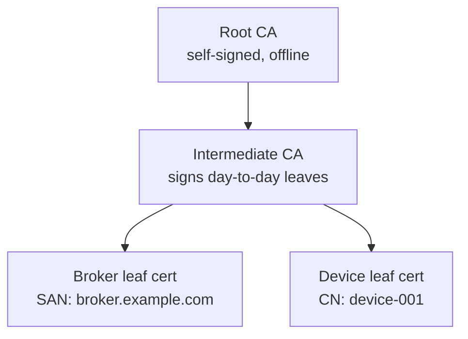
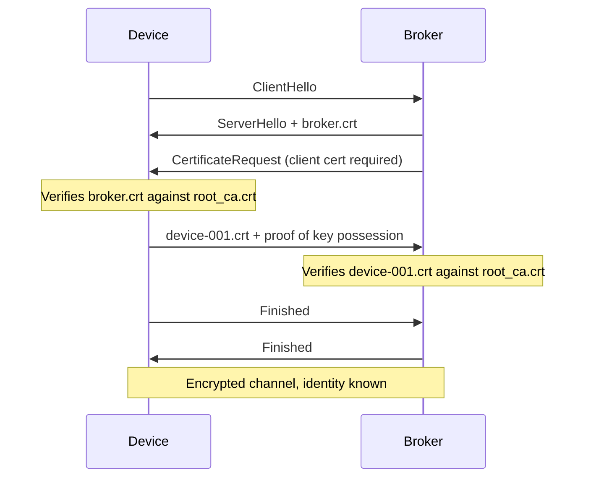

Password-based device auth doesn't survive contact with the real world: credentials get baked into firmware images, shared across a fleet, and leaked the first time someone greps a config file. Mutual TLS (mTLS) fixes this by giving every device its own cryptographic identity, issued by a certificate authority you control, and by making the server prove its identity right back. This tutorial builds the whole chain by hand — a private CA, a broker that demands client certificates, an HTTP gateway that does the same, and the renewal and revocation habits that keep it running for years — using only `step-ca`, `mosquitto`, and `nginx`.

## What mutual TLS actually buys you

Ordinary TLS, the kind your browser uses every day, is one-directional trust: the client verifies the server's certificate against a list of trusted CAs, but the server has no idea who the client is beyond "someone with a TCP connection." That's fine for public websites. It's not fine for a fleet of IoT devices publishing telemetry and accepting commands, because anyone who can reach the broker's port can pretend to be any device.

Mutual TLS closes that gap by running the same verification in both directions during the TLS handshake. The server presents a certificate, the client verifies it against a trusted root. Then the server turns around and asks the client for *its* certificate, and verifies that too. Only after both checks pass does the encrypted channel open. The practical result for a device fleet:

- Every device gets a unique certificate as its identity — no shared usernames or API keys to leak.
- The server can make authorization decisions from the certificate itself (its Common Name or Subject Alternative Name), not from a separate credential store.
- Revoking one device's trust doesn't touch any other device.
- Nothing works without possession of the device's private key, which never leaves the device.

> The private key for a certificate must never be transmitted anywhere. The CA issues a certificate for a key the device (or your issuance process) generated locally; the CA never sees the private half.

## PKI basics: root, intermediate, and leaf certificates

A public key infrastructure is just a chain of signatures. A **root CA** certificate is self-signed — it is the trust anchor, and every party that needs to verify certificates gets a copy of it out-of-band (baked into firmware, installed on a server). The root CA's private key signs one or more **intermediate CA** certificates, which in turn sign **leaf certificates** — the ones actually presented by your broker and your devices. Using an intermediate means the root's private key can live offline, touched only when you need to rotate the intermediate years from now; day-to-day issuance happens with the intermediate's key instead.

Two fields matter most on a leaf certificate:

- **Common Name (CN)** — historically the primary identity field, still widely used as a human-readable identifier such as a device serial number.
- **Subject Alternative Name (SAN)** — the field TLS clients actually check hostname/identity against. For a server certificate this is the broker's DNS name (and optionally IP); for a device certificate it's typically the device ID again, expressed as a URI or DNS-style SAN.

Here's the shape of the trust chain you're about to build: one root, one intermediate, and two kinds of leaves signed by that intermediate.



*The root's key stays cold; the intermediate does the signing that both the broker and every device certificate chain back to.*

## Standing up a private CA with step-ca

Smallstep's `step-ca` is an open-source certificate authority server with a companion `step` CLI for driving it. It handles the intermediate-signing workflow above without you touching OpenSSL by hand. Install both on the machine that will run the CA (a small VM or even a container is enough for a fleet in the thousands):

```bash
wget -q https://dl.smallstep.com/gh-release/certificates/gh-release-header/v0.27.4/step-ca_linux_0.27.4_amd64.tar.gz
tar -xzf step-ca_linux_0.27.4_amd64.tar.gz
sudo install -m 0755 step-ca_0.27.4/step-ca /usr/local/bin/step-ca

wget -q https://dl.smallstep.com/gh-release/cli/gh-release-header/v0.27.4/step_linux_0.27.4_amd64.tar.gz
tar -xzf step_linux_0.27.4_amd64.tar.gz
sudo install -m 0755 step_0.27.4/bin/step /usr/local/bin/step
```

Initialize the CA. This generates the root and intermediate key pairs, writes the CA configuration, and sets up a default provisioner (the identity that authorizes issuance requests):

```bash
step ca init \
  --name "IoT Fleet CA" \
  --dns ca.internal.example.com \
  --address ":9000" \
  --provisioner admin@example.com \
  --password-file /root/.step-ca/password.txt \
  --deployment-type standalone
```

This writes everything under `~/.step` by default: `certs/root_ca.crt`, `certs/intermediate_ca.crt`, the corresponding keys under `secrets/`, and `config/ca.json`. Guard the password file and the secrets directory with tight file permissions — anyone who reads the intermediate key can mint certificates your fleet will trust.

Start the CA server, pointing at the generated config and password file:

```bash
step-ca $(step path)/config/ca.json --password-file /root/.step-ca/password.txt
```

Run this under systemd in production rather than a foreground shell. With the CA up, confirm the root looks right — check the CN, validity window, and that it is indeed self-signed:

```bash
step certificate inspect $(step path)/certs/root_ca.crt --short
```

Copy `root_ca.crt` (never the key) to every machine — brokers, gateways, and devices — that needs to verify certificates issued by this CA. That single file is the trust anchor for the entire deployment.

## Issuing server and device certificates

With the CA reachable, requesting a certificate is one command per identity. For the MQTT broker, issue a server certificate whose SAN matches the hostname clients will connect to:

```bash
step ca certificate broker.example.com broker.crt broker.key \
  --provisioner admin@example.com \
  --san broker.example.com \
  --san 10.0.1.5 \
  --not-after 8760h
```

`--not-after 8760h` gives the broker cert a one-year lifetime — long enough that you're not fighting renewal races on a server that's hard to restart unattended, short enough to bound the blast radius if the key is ever exposed. Devices get much shorter-lived certificates, issued with the device's own identifier as both subject and SAN:

```bash
step ca certificate device-001 device-001.crt device-001.key \
  --provisioner admin@example.com \
  --not-after 2160h
```

`2160h` is 90 days. That's the meaningful design decision in this whole setup: a device certificate that expires in three months is a device certificate you don't need a fast revocation pipeline for. If a device is decommissioned or a key is suspected compromised, you stop renewing it and its access lapses on its own within the quarter — more on making that faster in the revocation section below. In production you'd script this issuance step as part of device provisioning (e.g., a factory-floor tool that runs on first boot, or a fleet-management job that calls the CA's REST API with a one-time provisioner token), but the underlying call is exactly this one command.

Distribute files by role like this:

| File | Contains | Lives on | Role |
| --- | --- | --- | --- |
| `root_ca.crt` | Root CA public cert | Broker, gateway, every device | Trust anchor — verifies any leaf in the chain |
| `broker.crt` / `broker.key` | Server leaf cert + key | MQTT broker only | Proves the broker's identity to connecting clients |
| `device-001.crt` / `device-001.key` | Client leaf cert + key | That one device only | Proves the device's identity to the broker/gateway |
| `gateway.crt` / `gateway.key` | Server leaf cert + key | HTTP gateway only | Proves the gateway's identity over HTTPS |

## Locking down MQTT with mutual TLS

Mosquitto's TLS listener supports client certificate verification natively. Add a listener block that points at the CA root, the broker's own cert and key, and turns on client verification:

```ini
listener 8883
cafile /etc/mosquitto/ca/root_ca.crt
certfile /etc/mosquitto/certs/broker.crt
keyfile /etc/mosquitto/certs/broker.key

require_certificate true
use_identity_as_username true
tls_version tlsv1.2
```

`require_certificate true` is what makes this *mutual* TLS rather than plain server-side TLS — without it, Mosquitto will happily accept connections that never present a client certificate at all. `use_identity_as_username true` takes the CN from the verified client certificate and uses it as the MQTT username for the rest of the session, which means your ACL file can authorize per device without a separate password database:

```ini
# /etc/mosquitto/acl.conf
pattern readwrite devices/%u/#
```

With that pattern, a client authenticated as `device-001` can only publish or subscribe under `devices/device-001/#` — the certificate identity becomes the authorization boundary directly. Restart Mosquitto and test the whole path with `mosquitto_pub`, presenting the CA root and the device's own cert/key:

```bash
mosquitto_pub \
  --cafile root_ca.crt \
  --cert device-001.crt \
  --key device-001.key \
  -h broker.example.com -p 8883 \
  -t devices/device-001/telemetry \
  -m '{"temp": 21.4}'
```

If that publishes without error, the full handshake — server cert verified by the client, client cert verified by the broker, identity mapped to a username, ACL enforced — just worked end to end.

## Requiring client certs on an HTTP gateway

Devices that talk HTTP instead of (or in addition to) MQTT need the same treatment on the gateway. nginx does this with three directives on a TLS server block: the CA used to verify incoming client certs, a switch to require them, and a variable exposing the verified identity to your backend.

```ini
server {
    listen 443 ssl;
    server_name gateway.example.com;

    ssl_certificate     /etc/nginx/certs/gateway.crt;
    ssl_certificate_key /etc/nginx/certs/gateway.key;

    ssl_client_certificate /etc/nginx/ca/root_ca.crt;
    ssl_verify_client on;

    location / {
        proxy_pass http://127.0.0.1:8080;
        proxy_set_header X-Client-DN $ssl_client_s_dn;
        proxy_set_header X-Client-Verify $ssl_client_verify;
    }
}
```

`ssl_verify_client on` rejects any connection that doesn't present a certificate signed by the CA in `ssl_client_certificate` before the request ever reaches your application. The backend still gets to make its own authorization decision, using `$ssl_client_s_dn` (the certificate's subject distinguished name, which includes the CN) forwarded as a header — parse the device ID out of it and check it against whatever device registry your application already has. Test it the same way as the MQTT case, but with `curl`:

```bash
curl https://gateway.example.com/api/status \
  --cacert root_ca.crt \
  --cert device-001.crt \
  --key device-001.key
```

Drop `--cert`/`--key` from that command and you should get nginx's connection-level rejection rather than an application response — that's the control working as intended.

## Certificate lifecycle: renewal

Short-lived certificates only work operationally if renewal is automatic — nobody wants to manually reissue 90-day certificates across a fleet by hand. `step` has a built-in renewal command that reuses the device's existing key and certificate to authenticate the renewal request, so no provisioner password needs to live on the device at runtime:

```bash
step ca renew device-001.crt device-001.key
```

For a long-running process, run it as a daemon that renews in the background well before expiry and reloads the consuming service:

```bash
step ca renew device-001.crt device-001.key \
  --daemon \
  --exec "systemctl reload mosquitto-client-agent"
```

If the device is something more like a cron-driven embedded job than a long-lived process, a periodic timer works just as well — trigger it at roughly a third of the certificate's lifetime so a missed run or two still leaves margin:

```bash
# crontab entry, runs daily against a 90-day cert
0 3 * * * step ca renew /etc/device/device-001.crt /etc/device/device-001.key --force
```

Renewal fails closed: if the CA is unreachable or the certificate has already expired past the renewal window, the old certificate simply stops being usable and the device loses connectivity until it can reach the CA again. That's a feature, not a bug — an unreachable device that can't renew is exactly the kind of device you don't want quietly running on ambient trust.

## Revocation: why and how

Renewal handles the expected case — certificates aging out on schedule. Revocation handles the unexpected one: a device is stolen, a key leaks, and you need that identity to stop working *now*, not at the end of its 90-day window.

The classical mechanisms are a Certificate Revocation List (CRL), a signed, periodically-published list of revoked serial numbers that verifiers download and check, and OCSP, a live per-certificate status query. Both have real operational cost: a CRL has to be fetched and refreshed by every verifier, and it grows forever until reissued; OCSP requires a responder that's reachable on every handshake, which turns an outage in one small service into an outage for your entire fleet's connectivity. Most MQTT and HTTP client stacks on constrained devices don't implement either check by default, so wiring up genuine CRL/OCSP enforcement on-device is real engineering effort, not a config flag.

`step-ca` does support explicit revocation — `step ca revoke <serial-number>` marks a certificate revoked in the CA's database, and the CA will refuse to renew it from that point on. That's **passive** revocation: it stops the certificate from being renewed, but a verifier that isn't checking a CRL will still accept the certificate until it naturally expires. Getting to **active** revocation — a connection rejected mid-lifetime — means also enabling CRL generation in `ca.json` and getting Mosquitto's `crlfile` and nginx's `ssl_crl` directives pointed at a copy of it, refreshed on a schedule.

The pragmatic middle ground used throughout this tutorial is to lean on short certificate lifetimes rather than building a CRL distribution pipeline from day one: run `step ca revoke` immediately to stop renewal, and treat the remaining validity window — bounded by your `--not-after` choice — as the maximum exposure time. A 90-day device certificate means a compromised device is fully cut off within 90 days even if you never touch a CRL; if that ceiling is too high for a given deployment, shorten the lifetime rather than reaching for OCSP first.

To visualize what's actually happening on the wire when a device connects, here's the handshake in order:



*Both certificates are verified before any application data (an MQTT CONNECT packet, an HTTP request) is exchanged.*

## Troubleshooting

A handful of failures cover nearly every mTLS problem you'll hit in practice:

- **`unable to get local issuer certificate`** — the verifier doesn't have the CA (or the full chain) it needs. Confirm `cafile`/`ssl_client_certificate` points at `root_ca.crt`, and if you're using an intermediate, that the leaf certificate file includes the intermediate in its chain (`step ca certificate` does this by default; hand-rolled OpenSSL setups often forget it).
- **CN/SAN mismatch** — a server certificate's SAN must match the hostname the client connects to exactly. If the broker is reachable as both `broker.example.com` and a bare IP, both need to be in the SAN list at issuance time; SAN can't be patched onto an existing certificate.
- **Clock skew** — TLS validity windows are absolute timestamps. A device with a wrong system clock will reject a perfectly valid certificate as "not yet valid" or "expired." Run NTP (or a lightweight equivalent) on every device before it ever touches the CA.
- **Key file permissions** — Mosquitto and nginx both refuse to start, or silently fail to read, a private key with permissions the running user can't access. `chmod 600` and check ownership matches the service user, not just root.
- **Mosquitto refuses every client** — usually `require_certificate true` paired with a `cafile` pointing at the wrong CA (e.g., the device certs were reissued under a new intermediate but the broker still trusts the old one), or a listener block that's missing `cafile` entirely and silently falls back to server-only TLS.
- **nginx: "No required SSL certificate was sent"** — the client genuinely didn't present a certificate. Check the client command actually includes `--cert`/`--key` (or your library's TLS context has a client certificate loaded), and that no proxy or load balancer in front of nginx is terminating TLS early and stripping the client cert before it reaches the `ssl_verify_client on` block.

## Wrap-up

The whole system reduces to three ideas working together: a CA you run and control issues short-lived identities, the broker and gateway both require and verify those identities in both directions, and renewal keeps working certificates flowing while letting old or compromised ones age out on a bounded schedule. None of it depends on a managed PKI vendor or a proprietary agent — `step-ca`, Mosquitto, and nginx are all you need to get a fleet of devices authenticating with real per-device certificates instead of a password everyone shares. From here, the natural next steps are automating issuance into your device provisioning flow and deciding, deployment by deployment, whether your revocation exposure window is small enough to live with or whether it's time to wire up a CRL.
