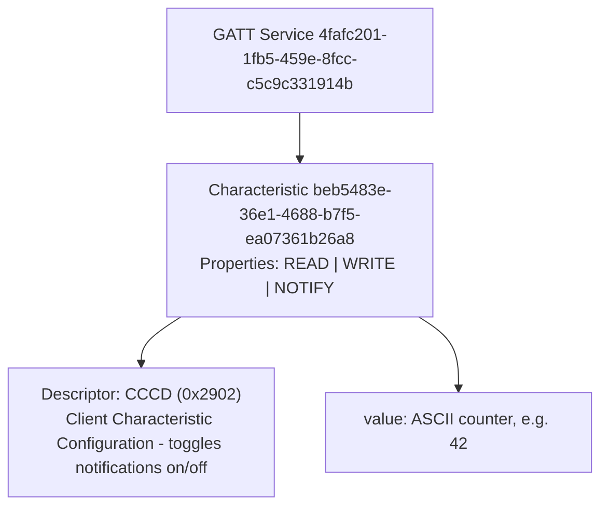
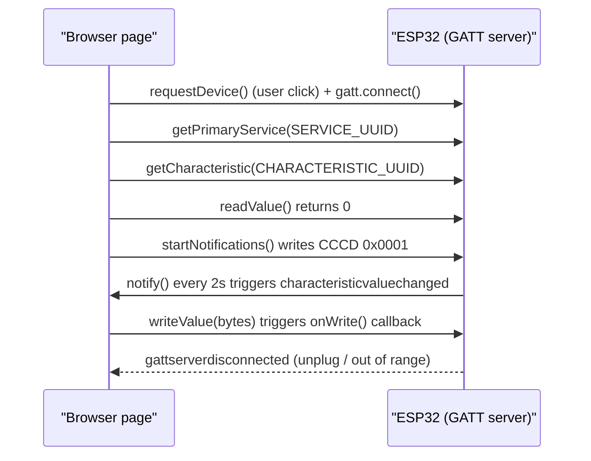

Bluetooth Low Energy is the easiest way to get a microcontroller talking to a phone or laptop without pairing dialogs, cables, or a Wi-Fi network in the mix. What's less obvious is that you don't need a native app to speak BLE anymore — a modern Chromium browser can scan for, connect to, and exchange data with a BLE peripheral directly from a web page, using nothing but JavaScript. This tutorial builds both ends of that conversation from scratch: an ESP32 running a small Arduino sketch that exposes a GATT service with a live counter, and a plain HTML page that connects to it with the Web Bluetooth API, reads the counter, subscribes to updates, and writes values back.

By the end you'll have a working round trip — ESP32 notifies, browser reacts; browser writes, ESP32 reacts — and a solid mental model of the GATT structure (services, characteristics, descriptors) that every BLE peripheral, not just this one, is built from.

## What you'll build

The ESP32 advertises a custom service with a single characteristic that supports read, write, and notify. Every two seconds, while a browser is connected, it increments a counter and pushes the new value out as a notification. The web page connects on a button click, reads the current value once, subscribes to future notifications, and lets you type a string to write back to the device.



*One service containing one characteristic, which carries one descriptor. This is the entire GATT tree the ESP32 advertises.*

## Prerequisites

- An ESP32 dev board (any variant with BLE — the classic ESP32, not the -S2, which has no Bluetooth radio) and a USB cable.
- Arduino IDE 2.x with the `esp32` board package installed (Boards Manager > search "esp32" by Espressif Systems, version 3.x). This bundles the built-in `BLEDevice` / `BLEServer` / `BLE2902` classes used below — no extra library install needed.
- A Chromium-based desktop browser: Chrome, Edge, or Opera on Windows, macOS, or Linux (Chrome/Edge on Android also work; iOS Safari does not support Web Bluetooth at all).
- A way to serve the web page over HTTPS or from `localhost` — Web Bluetooth refuses to run in an insecure context. Python's `http.server` bound to localhost is enough for local testing.

> **Note:** Web Bluetooth is not part of any W3C standard track and is implemented only by Chromium-based browsers. Firefox and Safari have both declined to implement it, citing the privacy surface of letting any web page scan for nearby hardware.

## The GATT model, briefly

Every BLE peripheral organizes its data as a tree:

- **Service** — a logical grouping of related data, identified by a UUID. A device can expose many services (e.g. Battery Service, Device Information, and your custom one).
- **Characteristic** — a single value inside a service, also identified by a UUID, with a set of **properties** that say what a client is allowed to do with it.
- **Descriptor** — metadata attached to a characteristic. The one you'll always see on a notifying characteristic is the **Client Characteristic Configuration Descriptor** (CCCD, UUID `0x2902`). Writing `0x0001` to it turns notifications on; `0x0000` turns them off. In the Arduino BLE library this descriptor is a concrete class, `BLE2902`, that you attach yourself — forgetting it is the single most common reason notifications silently never arrive.

| Property | Meaning | Who initiates |
| --- | --- | --- |
| `READ` | Client can fetch the current value on demand | Client (browser) |
| `WRITE` | Client can set the value; server sends a write response | Client (browser) |
| `WRITE_NR` | "Write without response" — fire-and-forget, no ack, higher throughput | Client (browser) |
| `NOTIFY` | Server pushes the value whenever it changes, no polling | Server (ESP32) |
| `INDICATE` | Like notify, but the client must ack each update | Server (ESP32) |

### Why 128-bit UUIDs

The Bluetooth SIG reserves a block of well-known 16-bit UUIDs (like `0x180F` for Battery Service) for standardized profiles. Anything custom — your own service and characteristic — must use a full 128-bit UUID so it can never collide with someone else's. Generate one with `uuidgen` on Linux/macOS or any online v4 UUID generator; the value itself is arbitrary, you just need it to be unique and to match exactly between the firmware and the web page.

## Part 1: the ESP32 GATT server

### Step 1 — pick your UUIDs

Generate two UUIDs, one for the service and one for the characteristic. This tutorial uses the pair below (borrowed from Espressif's own example, which is fine to reuse for local testing, but generate your own for anything real):

```ini
SERVICE_UUID        4fafc201-1fb5-459e-8fcc-c5c9c331914b
CHARACTERISTIC_UUID beb5483e-36e1-4688-b7f5-ea07361b26a8
```

### Step 2 — write the sketch

Create a new sketch and paste in the following. It initializes the BLE stack, creates a server with one service and one read/write/notify characteristic, attaches the CCCD descriptor, starts advertising, and then loops, pushing a fresh counter value out as a notification every two seconds while a client is connected.

```cpp
#include <BLEDevice.h>
#include <BLEServer.h>
#include <BLEUtils.h>
#include <BLE2902.h>

#define SERVICE_UUID        "4fafc201-1fb5-459e-8fcc-c5c9c331914b"
#define CHARACTERISTIC_UUID "beb5483e-36e1-4688-b7f5-ea07361b26a8"

BLECharacteristic *pCharacteristic;
bool deviceConnected = false;
uint32_t counter = 0;

class ServerCallbacks : public BLEServerCallbacks {
  void onConnect(BLEServer *pServer) override {
    deviceConnected = true;
    Serial.println("Client connected");
  }

  void onDisconnect(BLEServer *pServer) override {
    deviceConnected = false;
    Serial.println("Client disconnected, restarting advertising");
    // Advertising stops automatically on disconnect; restart it so a
    // new client (or a page reload) can find the device again.
    pServer->getAdvertising()->start();
  }
};

class CharacteristicCallbacks : public BLECharacteristicCallbacks {
  void onWrite(BLECharacteristic *pChar) override {
    std::string value = pChar->getValue();
    if (value.length() == 0) {
      return;
    }
    Serial.print("Received write: ");
    Serial.println(value.c_str());
  }
};

void setup() {
  Serial.begin(115200);

  BLEDevice::init("ESP32-Counter");

  BLEServer *pServer = BLEDevice::createServer();
  pServer->setCallbacks(new ServerCallbacks());

  BLEService *pService = pServer->createService(SERVICE_UUID);

  pCharacteristic = pService->createCharacteristic(
      CHARACTERISTIC_UUID,
      BLECharacteristic::PROPERTY_READ |
      BLECharacteristic::PROPERTY_WRITE |
      BLECharacteristic::PROPERTY_NOTIFY
  );
  pCharacteristic->setCallbacks(new CharacteristicCallbacks());
  // Without this descriptor the client can subscribe, but the stack
  // has nowhere to record that subscription and notify() is a no-op.
  pCharacteristic->addDescriptor(new BLE2902());
  pCharacteristic->setValue("0");

  pService->start();

  BLEAdvertising *pAdvertising = BLEDevice::getAdvertising();
  pAdvertising->addServiceUUID(SERVICE_UUID);
  pAdvertising->setScanResponse(true);
  pAdvertising->setMinPreferred(0x06);
  pAdvertising->setMinPreferred(0x12);
  BLEDevice::startAdvertising();

  Serial.println("Advertising as ESP32-Counter, waiting for a client...");
}

void loop() {
  if (deviceConnected) {
    counter++;
    char buf[16];
    snprintf(buf, sizeof(buf), "%lu", (unsigned long)counter);
    pCharacteristic->setValue(buf);
    pCharacteristic->notify();
    Serial.printf("Notified: %s\n", buf);
  }
  delay(2000);
}
```

Select your board and port under Tools, then flash it. Open the Serial Monitor at 115200 baud — you should see `Advertising as ESP32-Counter, waiting for a client...` and nothing else until a client connects.

> **Tip:** `addServiceUUID` in the advertising payload is what makes `filters: [{ services: [...] }]` work on the browser side later. If you skip it, the device still advertises, but Chrome's device chooser won't be able to match it by service UUID and it will look like the device simply isn't there.

## Part 2: connecting from the browser

The Web Bluetooth API exposes the same GATT concepts you just built in firmware: `requestDevice` to pick a device, `gatt.connect()` to open a connection, `getPrimaryService()` and `getCharacteristic()` to walk down the tree, then `readValue()`, `writeValue()`, and `startNotifications()` to actually move data.

### Step 3 — requestDevice and the security model

`navigator.bluetooth.requestDevice()` pops up the browser's own device chooser and returns a `BluetoothDevice` once the user picks one. Two things about it are non-negotiable:

- It must be called from inside a user gesture handler — a click, a tap, a keypress. Calling it on page load or from a `setTimeout` throws a `SecurityError`, because letting a page silently scan for nearby Bluetooth hardware without the user doing anything would be a serious privacy hole.
- The page itself must be a secure context: served over HTTPS, or from `http://localhost` / `http://127.0.0.1` during development. Plain HTTP on any other origin is refused outright.

`requestDevice` also requires either a `filters` array or `acceptAllDevices: true` — you can't leave both out. Filtering by service UUID is the normal case: it hides every nearby BLE device that doesn't advertise your service, which is both a better user experience and the reason Step 2's `addServiceUUID` call matters.

### Step 4 — the optionalServices allowlist

This trips up almost everyone the first time: even after `filters` matches your device, the resulting `BluetoothDevice` object will refuse to let you call `getPrimaryService()` for a UUID that wasn't also listed in `optionalServices` (or in a filter). Chrome enforces an explicit allowlist of which services a page is permitted to touch, separate from which services it's allowed to filter on. In practice, always list every custom service UUID you intend to use in `optionalServices`, even the ones you already filtered by.

### Step 5 — write the page

```html
<!doctype html>
<html lang="en">
<head>
  <meta charset="utf-8" />
  <title>BLE Counter</title>
</head>
<body>
  <button id="connect">Connect</button>
  <p>Value: <span id="value">--</span></p>
  <input id="writeVal" placeholder="text to write" />
  <button id="write">Write</button>

  <script>
    const SERVICE_UUID = "4fafc201-1fb5-459e-8fcc-c5c9c331914b";
    const CHARACTERISTIC_UUID = "beb5483e-36e1-4688-b7f5-ea07361b26a8";

    let characteristic = null;

    document.getElementById("connect").addEventListener("click", async () => {
      try {
        const device = await navigator.bluetooth.requestDevice({
          filters: [{ services: [SERVICE_UUID] }],
          optionalServices: [SERVICE_UUID],
        });
        device.addEventListener("gattserverdisconnected", onDisconnected);

        const server = await device.gatt.connect();
        const service = await server.getPrimaryService(SERVICE_UUID);
        characteristic = await service.getCharacteristic(CHARACTERISTIC_UUID);

        const initial = await characteristic.readValue();
        updateValue(initial);

        await characteristic.startNotifications();
        characteristic.addEventListener("characteristicvaluechanged", (event) => {
          updateValue(event.target.value);
        });
      } catch (err) {
        console.error("Connection failed:", err);
      }
    });

    document.getElementById("write").addEventListener("click", async () => {
      if (!characteristic) {
        return;
      }
      const text = document.getElementById("writeVal").value;
      const encoder = new TextEncoder();
      await characteristic.writeValue(encoder.encode(text));
    });

    function updateValue(dataView) {
      const decoder = new TextDecoder("utf-8");
      document.getElementById("value").textContent = decoder.decode(dataView);
    }

    function onDisconnected(event) {
      console.log("Device disconnected:", event.target.name);
      characteristic = null;
    }
  </script>
</body>
</html>
```

Serve this over `localhost`:

```bash
python3 -m http.server 8000
# then open http://localhost:8000/ in Chrome
```

Click Connect, pick "ESP32-Counter" from the chooser, and grant permission. The page reads the current counter once immediately, then updates live every two seconds as the ESP32 notifies. Typing into the text box and clicking Write sends bytes to the ESP32, which prints them to the Serial Monitor via `onWrite`.



*The full lifecycle: connect, discover, subscribe, exchange, and the disconnect event both sides need to handle.*

### Step 6 — handle disconnects

BLE links drop — the board resets, the page tab goes to sleep and the OS reclaims the radio, or someone walks out of range. Always listen for `gattserverdisconnected` on the `BluetoothDevice` object and null out your cached characteristic reference, as the sample above does. If you want automatic reconnection, call `device.gatt.connect()` again from that handler — but note that Chrome will not let you call `requestDevice()` again without a fresh user gesture, so keep a reference to the already-picked `device` object rather than trying to re-prompt.

## Troubleshooting

- **Device never shows up in the chooser.** Confirm the ESP32 is actually advertising (check the Serial Monitor output) and that your `filters` UUID matches exactly what the firmware calls `addServiceUUID` with — a single mismatched hyphen or case difference means no match. If you just want to confirm the device is reachable at all while debugging, temporarily swap `filters` for `acceptAllDevices: true` (you still need `optionalServices` to use the service afterward).
- **`SecurityError: Must be handling a user gesture...`** You called `requestDevice()` outside a click/tap handler, or the page isn't served from HTTPS or `localhost`. Check the address bar — `file://` URLs are not a secure context either.
- **`getPrimaryService()` rejects even though the device connected.** The service UUID isn't in `optionalServices`. Filtering on a UUID does not automatically grant access to it — list it in both places.
- **Notifications never fire, but `readValue()` works fine.** Almost always a missing CCCD descriptor on the firmware side — double check `pCharacteristic->addDescriptor(new BLE2902())` is present before `pService->start()`. If the descriptor is there, confirm `startNotifications()` resolved without throwing before you attach the `characteristicvaluechanged` listener.
- **Nothing works at all on Linux.** Web Bluetooth on Linux talks to the BlueZ stack via D-Bus and can be flaky depending on your BlueZ version and permissions. Check `chrome://bluetooth-internals` to see if Chrome can see adapters and devices at all; if not, verify `bluetoothd` is running and your user is in the appropriate group, and try toggling the experimental flag at `chrome://flags/#enable-web-bluetooth-new-permissions-backend`.
- **Stale cached GATT after reflashing the ESP32.** If you change the service/characteristic UUIDs and reflash, an already-paired browser tab may hold onto a cached GATT structure from the earlier connection. Fully disconnect (`device.gatt.disconnect()`), reload the page, and reconnect; on Linux you may also need to remove the stale device from BlueZ with `bluetoothctl remove <MAC>` if the OS-level pairing is confused rather than just the browser cache.
- **Writes silently fail with no error.** Make sure the characteristic was created with `PROPERTY_WRITE` (not just `WRITE_NR`) if you're calling `writeValue()` and expecting the default write-with-response behavior; a write-only-without-response characteristic paired with the wrong write method can behave inconsistently across Chrome versions.

## Wrap-up

The pattern here generalizes far beyond a counter: any sensor reading, actuator command, or configuration value can ride the same characteristic shape — read for current state, write for commands, notify for push updates — and the browser-side code barely changes between projects, since it's really just `requestDevice` → `connect` → `getPrimaryService` → `getCharacteristic` → read/write/subscribe. The two places worth double-checking whenever something doesn't work are the ones this tutorial called out twice each on purpose: the CCCD descriptor on the firmware side, and the `optionalServices` allowlist on the browser side. Get those two right and the rest of Web Bluetooth is refreshingly close to a plain event-driven API.
