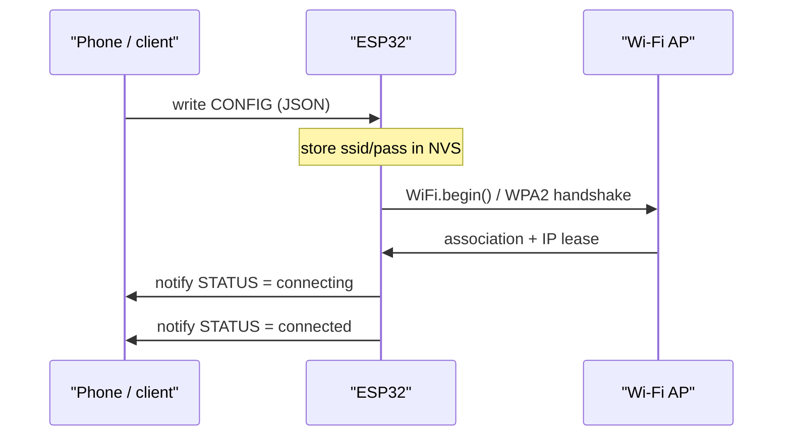
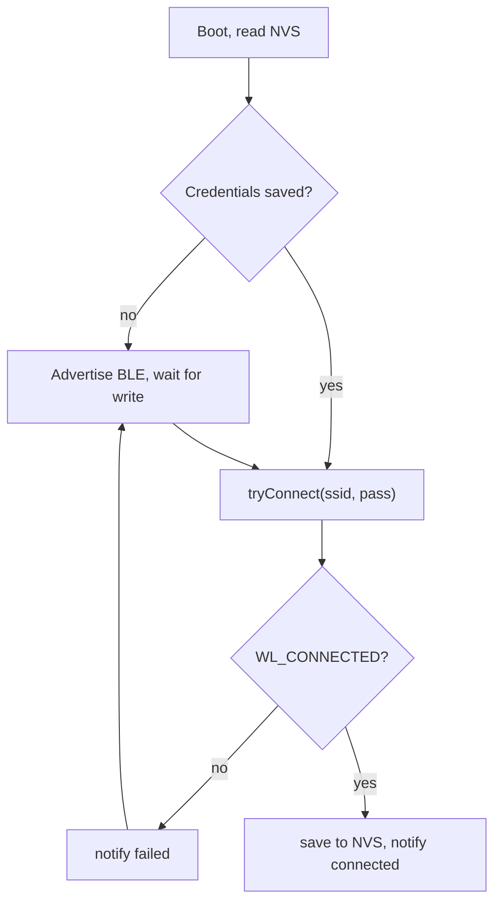

An ESP32 board with no screen and no keyboard still needs to join a Wi-Fi network before it can do anything useful. Baking the SSID and password into the firmware works for exactly one network, which means every unit you ship is locked to your desk's router. The moment you hand a device to someone else, or move it to a different room, hardcoded credentials stop working and you are back to re-flashing over USB. This post walks through a real, runnable pattern for solving that: a Bluetooth Low Energy provisioning service that lets a phone or laptop write Wi-Fi credentials to the device, which then stores them in non-volatile storage and reconnects on its own from then on.

## The problem with hardcoded credentials

Wi-Fi credentials do not belong in source code for three separate reasons. First, every device you build ends up joining the same network unless you maintain a per-unit firmware image, which does not scale past a handful of boards. Second, a password sitting in a `.ino` file or a header ends up in version control, in a bug report, or in a public GitHub repository the day someone forgets to gitignore it. Third, and most practically, the network your device will actually live on is unknown at build time — you are building in one place and deploying in another.

The standard answer, used by everything from smart plugs to industrial sensors, is out-of-band provisioning: the device starts in a temporary "setup" mode, a nearby client hands it the credentials over a short-range channel, the device persists them locally, and normal operation resumes. BLE is a good fit for this on the ESP32 because the same chip already has a BLE radio, phones support it natively, and the pairing UX (see a device, tap it, done) is something most users already understand from Bluetooth headphones and fitness trackers.

> Espressif ships a more elaborate version of this idea in ESP-IDF as `esp_wifi_prov` built on the `protocomm` layer, along with matching mobile SDKs and a "BLE Provisioning" reference app. It adds a proof-of-possession handshake and a security handshake (curve25519 key exchange) on top of the same basic idea shown here. It is worth reaching for once you need vendor-grade security guarantees; this post builds the minimal version by hand with the Arduino framework so every moving part is visible.

## Design: two radios, one flow

The device has exactly two jobs at boot: figure out whether it already knows how to reach a Wi-Fi network, and if not, open a temporary door for someone to tell it. That gives a small state machine.

| State | Meaning |
|---|---|
| BOOT_CHECK | Read saved SSID/password out of NVS via the Preferences library |
| PROVISIONING | No usable credentials yet (or the saved ones failed); BLE service is advertising and waiting for a write |
| CONNECTING | Credentials in hand (fresh or saved); `WiFi.begin()` called, waiting on `WiFi.status()` |
| CONNECTED | `WL_CONNECTED`, IP address assigned, device is on the network |
| FAILED | Connect attempt timed out or was rejected; falls back to PROVISIONING so the client can retry with corrected credentials |

On a fresh boot with empty NVS, the device goes straight to PROVISIONING and stays there until it receives credentials. On every later boot, it tries the saved credentials first and only opens BLE provisioning again if that attempt fails — a bad password, a network that has since changed, or a router that is simply out of range.

## Setting up the project

This uses the standard ESP32 Arduino core (the one installed via Arduino IDE's Boards Manager or PlatformIO's `espressif32` platform), which already bundles the `BLEDevice` library and the `Preferences` library — no extra installs needed for those. The only third-party dependency is **ArduinoJson** by Benoit Blanchon, installable from the Library Manager, used to parse the credential payload.

## The BLE GATT provisioning service

Rather than exposing separate write characteristics for SSID and password, this service uses a single characteristic that accepts a small JSON document. Two separate writes force the client to get the ordering right and leave a window where the device has a new SSID paired with a stale password (or vice versa) if the second write never arrives. One atomic write avoids that class of bug entirely.

| Characteristic | UUID | Properties | Purpose |
|---|---|---|---|
| CONFIG | `...5e70` | Write | Accepts `{"ssid":"...","pass":"..."}` as UTF-8 JSON |
| STATUS | `...5e71` | Read, Notify | Current state as a short string: `provisioning`, `connecting`, `connected`, `failed` |
| RESET | `...5e72` | Write | Any write erases saved credentials and re-opens provisioning (factory reset) |

Here is the service setup, along with the write handler that parses the JSON payload:

```cpp
#include <Arduino.h>
#include <WiFi.h>
#include <Preferences.h>
#include <ArduinoJson.h>
#include <BLEDevice.h>
#include <BLEServer.h>
#include <BLEUtils.h>
#include <BLE2902.h>

#define SERVICE_UUID     "7a0c2eae-1c5d-4f8e-9a3d-1a2b3c4d5e6f"
#define CHAR_CONFIG_UUID "7a0c2eae-1c5d-4f8e-9a3d-1a2b3c4d5e70"
#define CHAR_STATUS_UUID "7a0c2eae-1c5d-4f8e-9a3d-1a2b3c4d5e71"
#define CHAR_RESET_UUID  "7a0c2eae-1c5d-4f8e-9a3d-1a2b3c4d5e72"

Preferences prefs;
BLECharacteristic *statusChar = nullptr;
BLEServer *bleServer = nullptr;

volatile bool credentialsPending = false;
String pendingSsid;
String pendingPass;

void notifyStatus(const char *msg) {
  if (statusChar == nullptr) return;
  statusChar->setValue(msg);
  statusChar->notify();
}

class ConfigCallbacks : public BLECharacteristicCallbacks {
  void onWrite(BLECharacteristic *chr) override {
    std::string raw = chr->getValue();
    if (raw.empty()) return;

    StaticJsonDocument<256> doc;
    if (deserializeJson(doc, raw)) {
      notifyStatus("bad_json");
      return;
    }

    const char *ssid = doc["ssid"];
    const char *pass = doc["pass"];
    if (ssid == nullptr || strlen(ssid) == 0 || strlen(ssid) > 32) {
      notifyStatus("bad_ssid");
      return;
    }
    if (pass != nullptr && strlen(pass) > 63) {
      notifyStatus("bad_pass");
      return;
    }

    pendingSsid = String(ssid);
    pendingPass = String(pass == nullptr ? "" : pass);
    credentialsPending = true;
  }
};

class ResetCallbacks : public BLECharacteristicCallbacks {
  void onWrite(BLECharacteristic *chr) override {
    prefs.remove("ssid");
    prefs.remove("pass");
    notifyStatus("erased");
    WiFi.disconnect(true);
  }
};
```

The 32/63 character limits are not arbitrary: they are the maximum SSID length and the maximum WPA2-PSK passphrase length defined by the 802.11 and WPA2 specs, so rejecting anything longer before it ever reaches `WiFi.begin()` saves a confusing round trip.

## Persisting credentials in NVS

The `Preferences` library is a thin, key-value wrapper around ESP-IDF's NVS (non-volatile storage) partition — the same flash region used to survive reboots and power loss. Opening a namespace, reading, writing, and erasing are all it takes:

```cpp
prefs.begin("wifi-creds", false);   // false = read/write
String savedSsid = prefs.getString("ssid", "");
String savedPass = prefs.getString("pass", "");

prefs.putString("ssid", pendingSsid);
prefs.putString("pass", pendingPass);

prefs.remove("ssid");   // used by the RESET characteristic above
prefs.remove("pass");
```

Only write to NVS after a connection attempt actually succeeds. Saving unverified credentials means a typo turns into a device that is stuck retrying a network that was never going to work, every single boot, forever.

## Connecting and reporting status

The connect helper is shared by both the "saved credentials on boot" path and the "fresh write from BLE" path. It blocks with a timeout rather than relying on the `WiFi.onEvent` callback API, which keeps the state machine easy to follow in a tutorial — a production sketch might prefer the event-driven form to avoid blocking the loop during connect.

```cpp
bool tryConnect(const String &ssid, const String &pass, uint32_t timeoutMs) {
  notifyStatus("connecting");

  WiFi.mode(WIFI_STA);
  WiFi.begin(ssid.c_str(), pass.c_str());

  uint32_t start = millis();
  while (WiFi.status() != WL_CONNECTED && millis() - start < timeoutMs) {
    delay(250);
  }

  if (WiFi.status() == WL_CONNECTED) {
    notifyStatus("connected");
    Serial.print("Connected, IP: ");
    Serial.println(WiFi.localIP());
    return true;
  }

  notifyStatus("failed");
  return false;
}
```

## The full boot flow

Putting the pieces together: `setup()` starts BLE advertising, checks NVS, and tries a saved connection before ever waiting for a BLE write; `loop()` just watches for the flag the write callback sets.

```cpp
void startProvisioning() {
  BLEDevice::init("esp32-provision");
  bleServer = BLEDevice::createServer();
  BLEService *service = bleServer->createService(SERVICE_UUID);

  BLECharacteristic *configChar = service->createCharacteristic(
      CHAR_CONFIG_UUID, BLECharacteristic::PROPERTY_WRITE);
  configChar->setCallbacks(new ConfigCallbacks());

  statusChar = service->createCharacteristic(
      CHAR_STATUS_UUID,
      BLECharacteristic::PROPERTY_READ | BLECharacteristic::PROPERTY_NOTIFY);
  statusChar->addDescriptor(new BLE2902());
  statusChar->setValue("provisioning");

  BLECharacteristic *resetChar = service->createCharacteristic(
      CHAR_RESET_UUID, BLECharacteristic::PROPERTY_WRITE);
  resetChar->setCallbacks(new ResetCallbacks());

  service->start();

  BLEAdvertising *advertising = BLEDevice::getAdvertising();
  advertising->addServiceUUID(SERVICE_UUID);
  advertising->setScanResponse(true);
  BLEDevice::startAdvertising();

  Serial.println("Advertising as esp32-provision");
}

void setup() {
  Serial.begin(115200);
  prefs.begin("wifi-creds", false);

  String savedSsid = prefs.getString("ssid", "");
  String savedPass = prefs.getString("pass", "");

  startProvisioning();

  if (savedSsid.length() > 0) {
    Serial.println("Found saved credentials, trying direct connect");
    if (tryConnect(savedSsid, savedPass, 15000)) {
      return;
    }
  }
  // still provisioning: wait in loop() for a CONFIG write
}

void loop() {
  if (credentialsPending) {
    credentialsPending = false;
    if (tryConnect(pendingSsid, pendingPass, 15000)) {
      prefs.putString("ssid", pendingSsid);
      prefs.putString("pass", pendingPass);
    }
  }
  delay(50);
}
```

BLE advertising is started unconditionally, even on the fast path where saved credentials work first try. That way a RESET write is always possible without a physical reset, and the STATUS characteristic has somewhere to notify to no matter which path the device took.



*Provisioning sequence: a JSON write, an NVS commit, a Wi-Fi association, and a status notification back to the client.*



*Boot-time decision flow: saved credentials get one direct attempt before provisioning re-opens.*

## Testing the provisioning flow

The fastest way to exercise this without writing a companion app is a generic BLE explorer on a phone — **nRF Connect** (Android/iOS) or **LightBlue** (iOS/macOS) both work well:

1. Flash the sketch, open the serial monitor, and confirm it prints `Advertising as esp32-provision`.
2. Scan for BLE devices in the app and connect to `esp32-provision`.
3. Open the service with the UUID ending in `...5e6f` and find the CONFIG characteristic (`...5e70`).
4. Write the UTF-8 bytes of `{"ssid":"MyHomeNetwork","pass":"correct horse battery staple"}` to it.
5. Enable notifications on the STATUS characteristic (`...5e71`) and watch it move from `connecting` to `connected` (or `failed`).

On Linux, `bluetoothctl`'s built-in GATT menu does the same thing from a terminal without installing anything extra:

```bash
bluetoothctl
[bluetoothctl]# scan on
[bluetoothctl]# connect AA:BB:CC:DD:EE:FF
[bluetoothctl]# menu gatt
[bluetoothctl]# select-attribute 7a0c2eae-1c5d-4f8e-9a3d-1a2b3c4d5e70
[bluetoothctl]# write "{\"ssid\":\"MyHomeNetwork\",\"pass\":\"correcthorse\"}"
[bluetoothctl]# select-attribute 7a0c2eae-1c5d-4f8e-9a3d-1a2b3c4d5e71
[bluetoothctl]# notify on
```

## Security considerations

This sketch is written for clarity, not for a production threat model, and it is worth being honest about the gap. A plain BLE write, with no bonding or link-layer encryption negotiated first, is visible in plaintext to anyone within radio range running a BLE sniffer (a $20 nRF52840 dongle plus Wireshark is enough). During the short provisioning window, that means the Wi-Fi password crosses the air unencrypted.

> Treat the version above as a starting point for a trusted lab bench, not as something to ship to end users unmodified. Before shipping, close the gaps below.

Three concrete improvements close most of the gap:

- **Turn on bonding and encryption.** Require the link to be encrypted before the CONFIG write is accepted, using `ESP_GATT_PERM_WRITE_ENCRYPTED` on the characteristic and the `BLESecurity` class to negotiate a bonded, encrypted link:

  ```cpp
  #include <BLESecurity.h>

  configChar->setAccessPermissions(ESP_GATT_PERM_WRITE_ENCRYPTED);

  BLESecurity *security = new BLESecurity();
  security->setAuthenticationMode(ESP_LE_AUTH_REQ_SC_BOND);
  security->setCapability(ESP_IO_CAP_NONE);   // Just Works; use ESP_IO_CAP_OUT for a displayed passkey
  security->setInitEncryptionKey(ESP_BLE_ENC_KEY_MASK | ESP_BLE_ID_KEY_MASK);
  security->setRespEncryptionKey(ESP_BLE_ENC_KEY_MASK | ESP_BLE_ID_KEY_MASK);
  ```

  "Just Works" pairing (`ESP_IO_CAP_NONE`) stops passive sniffing but not an active attacker sitting between the phone and the device during pairing; a displayed or entered passkey (`ESP_IO_CAP_OUT` / `ESP_IO_CAP_IN`) is needed for real man-in-the-middle protection.
- **Keep the provisioning window short.** Advertising indefinitely widens the attack surface for no benefit once the device is on the network. Stop `BLEDevice::stopAdvertising()` a few minutes after boot if no write has arrived, and require a physical action (a boot button held on power-up) to re-open it — rather than leaving a permanently open, unauthenticated RESET characteristic as the only way back into provisioning mode.
- **Never log the password.** The example above logs the IP address, not the credentials, on purpose. It is easy to add a debug `Serial.println(pass)` while developing and forget to remove it before the board ships with a UART header still exposed.

## Troubleshooting

- **NVS is full or the partition is corrupt.** `Preferences::begin()` returning `false`, or writes silently failing, usually means the NVS partition needs a clean slate: call `nvs_flash_erase()` followed by `nvs_flash_init()` once (from ESP-IDF's `nvs_flash.h`), or simply erase the whole partition table with `esptool.py erase_flash` before reflashing.
- **Credential length rejected unexpectedly.** The 32-byte SSID and 63-byte WPA2 passphrase limits are hard ceilings from the 802.11 and WPA2 specs, not arbitrary choices in the code above — a network name or passphrase that exceeds them cannot be represented, and the client app needs to validate before sending, not just the device.
- **The device never leaves provisioning mode.** The two most common causes are a typo in the password (check the STATUS notifications for `failed` rather than assuming a silent hang) and a 5 GHz-only network — the ESP32's radio only supports 2.4 GHz 802.11 b/g/n, so a router broadcasting the same SSID on both bands can still leave the device unable to associate if it happens to pick the 5 GHz BSSID.
- **Notifications never arrive at the client.** A central has to explicitly subscribe by writing to the Client Characteristic Configuration Descriptor (the `BLE2902` descriptor added to the STATUS characteristic) before `notify()` calls produce any packets. If the app's UI shows "subscribe" or a bell icon on the characteristic, that step has to happen before the CONFIG write, or the first few status updates are dropped on the floor.
- **BLE and Wi-Fi fighting over the radio.** The ESP32 has one 2.4 GHz radio shared between BLE and Wi-Fi through time-division coexistence handled inside ESP-IDF. During the few seconds of `WiFi.begin()`'s association handshake, BLE notifications can be delayed or occasionally missed. This is expected, not a bug — poll `WiFi.status()` from the client side too, or simply retry the notify subscription, rather than assuming a dropped packet means the write failed.

## Wrap-up

The pattern here is small on purpose: one GATT service, one JSON write, one NVS namespace, and a status characteristic to close the loop. That is enough to take a headless ESP32 from "needs a laptop and a USB cable" to "advertises for a minute, takes a Wi-Fi password from a phone, and comes back online on its own after every reboot." The places worth spending more time before shipping to real users are exactly the ones called out above — bonding and encryption on the write path, a provisioning window that actually closes, and length validation on both ends of the wire. Everything else in a fuller provisioning flow (a captive portal fallback, multi-network profiles, remote credential rotation) is an extension of the same three pieces: a way in, a place to persist what came in, and a way to report back whether it worked.
